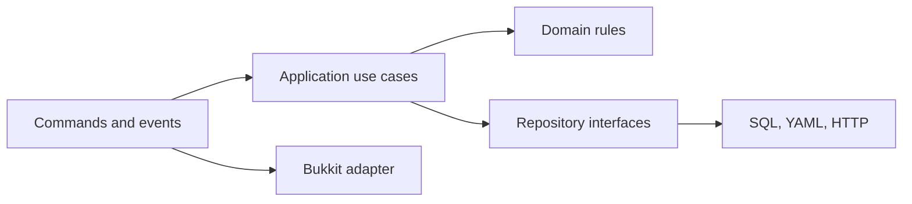

# Plugin architecture

A maintainable plugin has a small composition root, feature-owned lifecycle, testable domain decisions, and adapters around Bukkit, storage, and external systems.

## Layers by responsibility

- Commands and listeners adapt Bukkit inputs into application requests.
- Application services coordinate use cases and transactions.
- Domain objects enforce rules without reaching into global server state.
- Repositories and gateways adapt databases, files, HTTP, and other plugins.

## Dependency direction

- Pass dependencies through constructors.
- Depend on narrow interfaces owned by the consuming layer.
- Keep `JavaPlugin` and static Bukkit access near the platform boundary.
- Return stable domain values instead of leaking live `Player`, `World`, or `Inventory` objects through every layer.

## Feature lifecycle

- Each feature registers and closes its own listeners, tasks, sessions, views, and services.
- Bootstrap features only after configuration and required dependencies are valid.
- Allow partial optional integrations without weakening core invariants.
- Make shutdown safe after both full and partial startup.

## Dependency flow



## Example

```java
public final class HomesFeature implements AutoCloseable {
    private final HomeService service;
    private final Listener listener;

    public static HomesFeature start(JavaPlugin plugin, HomeRepository repository) {
        HomeService service = new HomeService(repository);
        Listener listener = new HomeListener(service);
        plugin.getServer().getPluginManager().registerEvents(listener, plugin);
        return new HomesFeature(service, listener);
    }

    @Override public void close() { HandlerList.unregisterAll(listener); }
}
```

## Review checklist

- The feature has one clear lifecycle owner.
- Failure paths are observable and preserve valid previous state.
- Resource, queue, cache, and loop bounds are explicit.
- The final built JAR is tested on every claimed server line.