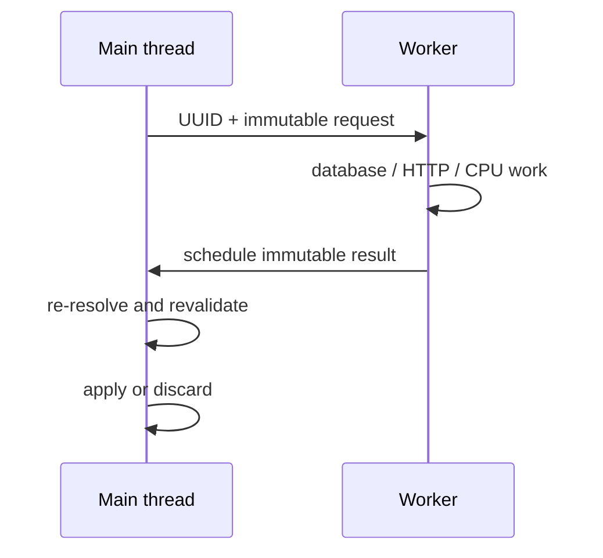

# Threading and async safety

Most Bukkit game state belongs to the main thread. Async code should operate on isolated immutable data, perform blocking or expensive work, then schedule a small revalidated continuation.

## Safe boundary

- Capture UUIDs, request IDs, primitive values, immutable records, or approved snapshots.
- Do not pass live players, entities, worlds, inventories, block states, or mutable config into arbitrary workers.
- Use a bounded executor so overload produces backpressure instead of unbounded threads.
- Propagate exceptions and cancellation to an observable owner.

## Return to the server

- Schedule through the Bukkit scheduler.
- Resolve live objects again by stable ID.
- Check plugin enabled state, player connection, world/chunk availability, permissions, and request/session generation.
- Discard stale results without mutating current state.

## Ordering and shutdown

- Use per-identity sequencing or transactions when writes can race.
- Make duplicate operations idempotent.
- Stop accepting work during disable, cancel where safe, drain required writes, then close the executor.
- Never block the main thread waiting for a future that needs the main thread to complete.

## Thread handoff



## Example

```java
UUID id = player.getUniqueId();
long generation = sessions.generation(id);
CompletableFuture.supplyAsync(() -> repository.load(id), executor)
    .thenAccept(value -> Bukkit.getScheduler().runTask(plugin, () -> {
        Player current = Bukkit.getPlayer(id);
        if (current == null || sessions.generation(id) != generation) return;
        apply(current, value);
    }));
```

## Review checklist

- The feature has one clear lifecycle owner.
- Failure paths are observable and preserve valid previous state.
- Resource, queue, cache, and loop bounds are explicit.
- The final built JAR is tested on every claimed server line.