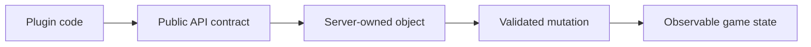

# Complete API reference

This catalog covers every public package exposed by the current Spigot API. Package pages explain scope, important types, safety rules, and link directly to the generated official reference for every class and member.

{/* visual-map:start */}
## Visual map

{/* visual-map:end */}

## Boundaries

- `org.bukkit`: shared Bukkit plugin contracts.
- `org.spigotmc`: Spigot-specific public additions.
- Not stable API: `org.bukkit.craftbukkit`, NMS packages, server implementation classes, and undocumented internals.

<Note>
Exact signatures and available overloads are version-specific. The official Javadocs linked on every package page are authoritative.
</Note>
