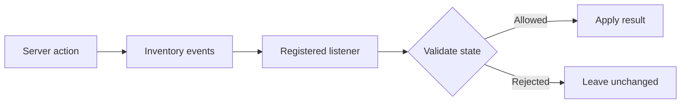

# Inventory events

`org.bukkit.event.inventory`

{/* visual-map:start */}
## Visual map

{/* visual-map:end */}

This package is part of the public Bukkit/Spigot plugin API.

## Important types

- `InventoryClickEvent`
- `InventoryDragEvent`
- `InventoryOpenEvent`
- `CraftItemEvent`

## Usage workflow

1. Enter through a public server object, event, factory, registry, or service.
2. Program against the public interface rather than an implementation class.
3. Read nullability, mutability, lifecycle, and thread requirements.
4. Use namespaced keys for plugin-owned registrations and persistent values.
5. Re-check live object validity after delayed or asynchronous work.
6. Follow deprecation links before changing versions.

## Safety and performance

Live worlds, entities, players, inventories, chunks, and plugin state generally belong to the main server thread. Bound searches and loops, avoid blocking I/O, and release registrations or retained objects during shutdown.

<Card title="Open every org.bukkit.event.inventory type and member" icon="arrow-up-right-from-square" href="https://hub.spigotmc.org/javadocs/bukkit/org/bukkit/event/inventory/package-summary.html">
The official Javadocs contain every class, interface, enum, record, annotation, constructor, field, method, overload, generic bound, inherited member, deprecation, and exact signature.
</Card>

<Warning>
Do not implement server-owned interfaces, construct built-in events, or depend on CraftBukkit/NMS implementation classes unless the exact API explicitly supports that use.
</Warning>
