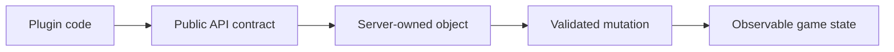

# Types and contracts

{/* visual-map:start */}
## Visual map

{/* visual-map:end */}

## Server-owned interfaces

Most Bukkit objects are interfaces implemented by the server. Obtain them from API methods rather than implementing or constructing them.

## Registries and keys

Modern APIs use `NamespacedKey`, `Keyed`, and `Registry<T>`. Persist keys, not enum ordinals or implementation class names.

## Nullability

Handle `@Nullable` results and failed lookups. Objects can become invalid after players disconnect, entities disappear, worlds unload, or plugins disable.

## Live objects and snapshots

Worlds, blocks, entities, players, and inventories are live. Snapshot and copy types must be applied back explicitly when required.

## Deprecations

Read the deprecation explanation. A replacement may use a registry, component, richer type, or different lifecycle rather than a simple renamed method.
