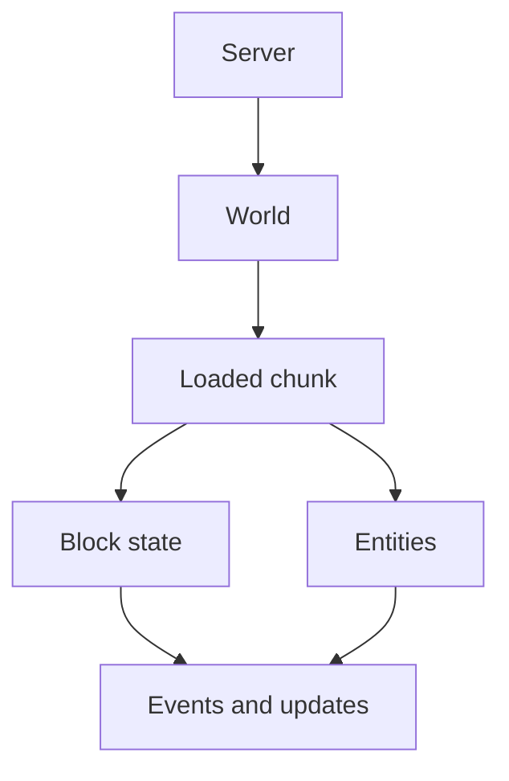

A `Chunk` is a 16×16 column of blocks that extends from the bottom to the top of the world. The server loads and unloads chunks dynamically as players move around — only the chunks near active players are kept in memory at any given time. The `Chunk` interface gives you direct access to the blocks, entities, and tile entities within a chunk, as well as control over whether the chunk stays loaded.

{/* visual-map:start */}
## Visual map


{/* visual-map:end */}

---

## Core Coordinate and World Methods

<ResponseField name="getX()" type="int">
  Returns the chunk's X coordinate in chunk space. To convert from a block X coordinate to a chunk X coordinate, use integer division: `blockX >> 4` (equivalent to `blockX / 16`).
</ResponseField>

<ResponseField name="getZ()" type="int">
  Returns the chunk's Z coordinate in chunk space. Convert from block Z the same way: `blockZ >> 4`.
</ResponseField>

<ResponseField name="getWorld()" type="@NotNull World">
  Returns the `World` that contains this chunk. Use this to access world-level methods from a chunk reference without needing to pass the world separately.
</ResponseField>

---

## Block Access

<ResponseField name="getBlock(int x, int y, int z)" type="@NotNull Block">
  Returns the block at the given chunk-local coordinates. All three parameters are relative to the chunk's own origin — not world coordinates.

  <ParamField path="x" type="int" required>
    Chunk-local X offset, **0–15**.
  </ParamField>
  <ParamField path="y" type="int" required>
    World Y coordinate, from the world's `minHeight` (inclusive) to `maxHeight` (exclusive).
  </ParamField>
  <ParamField path="z" type="int" required>
    Chunk-local Z offset, **0–15**.
  </ParamField>
</ResponseField>

<Note>
  `getBlock()` uses coordinates local to the chunk, not world coordinates. If you have world coordinates, use `world.getBlockAt(x, y, z)` directly, or convert with `blockX & 0xF` to get the local offset.
</Note>

---

## Entity and Tile Entity Access

<ResponseField name="getEntities()" type="@NotNull Entity[]">
  Returns an array of all entities currently residing in this chunk. If the chunk's entities are not yet loaded (see `isEntitiesLoaded()`), this call forces them to load before returning.
</ResponseField>

<ResponseField name="getTileEntities()" type="@NotNull BlockState[]">
  Returns an array of all tile entities (chests, furnaces, signs, etc.) in this chunk as `BlockState` objects. You can cast each `BlockState` to the specific subtype (e.g. `Chest`, `Furnace`) to access its inventory or other state.
</ResponseField>

<ResponseField name="isEntitiesLoaded()" type="boolean">
  Returns `true` if the entity data for this chunk has been loaded into memory. Calling `getEntities()` on a chunk where this returns `false` will trigger an entity load.
</ResponseField>

```java title="Iterating entities in a chunk"
Chunk chunk = world.getChunkAt(player.getLocation());
for (Entity entity : chunk.getEntities()) {
    if (entity instanceof Monster) {
        entity.remove(); // Clear all hostile mobs from the chunk
    }
}
```

---

## Load State

<ResponseField name="isLoaded()" type="boolean">
  Returns `true` if the chunk is currently held in memory. An unloaded chunk cannot be interacted with without first calling `load()`.
</ResponseField>

<ResponseField name="isGenerated()" type="boolean">
  Returns `true` if the chunk has been fully generated. A chunk may be partially generated (terrain exists but decoration passes have not run) before this returns `true`.
</ResponseField>

<ResponseField name="load()" type="boolean">
  Loads the chunk, generating it from the world's generator if it does not yet exist on disk. Returns `true` if loading succeeded.
</ResponseField>

<ResponseField name="load(boolean generate)" type="boolean">
  Loads the chunk, with optional generation control. Returns `true` if loading succeeded.

  <ParamField path="generate" type="boolean" required>
    If `true`, the chunk is generated from scratch when it does not already exist. If `false`, the call returns `false` rather than generating a new chunk.
  </ParamField>
</ResponseField>

<ResponseField name="unload()" type="boolean">
  Saves and unloads this chunk. Returns `true` if the chunk was successfully removed from memory.
</ResponseField>

<ResponseField name="unload(boolean save)" type="boolean">
  Unloads this chunk, optionally saving it first.

  <ParamField path="save" type="boolean" required>
    `true` to write the chunk to disk before unloading; `false` to discard any unsaved changes.
  </ParamField>
</ResponseField>

<Warning>
  Calling `unload(false)` discards any block changes, entity movements, or other mutations that occurred since the last save. Only pass `false` when you intentionally want to roll back a chunk's state.
</Warning>

---

## ChunkSnapshot — Async-Safe Reads

Reading a live `Chunk` from a background thread is unsafe because the main server thread can mutate the chunk concurrently. Use `ChunkSnapshot` to take a point-in-time copy of the chunk data that is safe to read from any thread.

<ResponseField name="getChunkSnapshot()" type="@NotNull ChunkSnapshot">
  Captures a thread-safe, read-only snapshot of the chunk's block types, data, and sky/block light levels at the moment of the call. The snapshot does not update when the world changes.
</ResponseField>

<ResponseField name="getChunkSnapshot(boolean includeMaxblocky, boolean includeBiome, boolean includeBiomeTempRain)" type="@NotNull ChunkSnapshot">
  Captures a snapshot with configurable optional data, allowing you to include per-column height maps, per-coordinate biome data, and raw biome temperature/rainfall values.

  <ParamField path="includeMaxblocky" type="boolean" required>
    Include per-column maximum Y values in the snapshot.
  </ParamField>
  <ParamField path="includeBiome" type="boolean" required>
    Include per-coordinate biome type data.
  </ParamField>
  <ParamField path="includeBiomeTempRain" type="boolean" required>
    Include raw biome temperature and rainfall values per coordinate.
  </ParamField>
</ResponseField>

```java title="Async chunk analysis with ChunkSnapshot"
Chunk chunk = world.getChunkAt(x, z);
ChunkSnapshot snapshot = chunk.getChunkSnapshot(false, true, false);

// Safe to use on an async thread
Bukkit.getScheduler().runTaskAsynchronously(plugin, () -> {
    for (int bx = 0; bx < 16; bx++) {
        for (int bz = 0; bz < 16; bz++) {
            Biome biome = snapshot.getBiome(bx, 64, bz);
            // Analyse biome data without touching the live world
        }
    }
});
```

<Tip>
  Always capture the `ChunkSnapshot` on the main thread, then hand it off to your async task. The snapshot itself is immutable and safe to share across threads.
</Tip>

---

## Iterating All Loaded Chunks

You can iterate over all chunks currently in memory using `World.getLoadedChunks()`:

```java title="Iterating loaded chunks"
for (Chunk chunk : world.getLoadedChunks()) {
    // Process each loaded chunk
    plugin.getLogger().info(
        "Chunk (" + chunk.getX() + ", " + chunk.getZ() + ") is loaded."
    );
}
```

<Warning>
  Iterating over all loaded chunks — especially on large servers — can be expensive. Avoid doing this every tick. If you only need to react when a chunk loads or unloads, listen to `ChunkLoadEvent` and `ChunkUnloadEvent` instead.
</Warning>

---

## Force-Loaded Chunks

A force-loaded chunk stays in memory regardless of player proximity. Use this when your plugin needs a region of the world to remain active — for example, to keep a farm ticking or maintain a persistent redstone circuit.

<ResponseField name="isForceLoaded()" type="boolean">
  Returns `true` if this chunk is currently set to remain loaded regardless of player activity.
</ResponseField>

<ResponseField name="setForceLoaded(boolean forced)" type="void">
  Enables or disables force-loading for this chunk.

  <ParamField path="forced" type="boolean" required>
    `true` to prevent the chunk from being unloaded by the server; `false` to restore normal unload behaviour.
  </ParamField>
</ResponseField>

For finer-grained control, you can use plugin chunk tickets, which associate a specific plugin with the loaded state of a chunk. A chunk with at least one active ticket will not unload:

```java title="Plugin chunk tickets"
// Keep the chunk loaded as long as the plugin is enabled
chunk.addPluginChunkTicket(plugin);

// Release the ticket when you no longer need the chunk pinned
chunk.removePluginChunkTicket(plugin);
```

<Note>
  Plugin tickets are automatically released when a plugin is disabled. If you add a ticket and do not remove it yourself, it will be cleaned up on server shutdown or plugin reload.
</Note>

---

## LoadLevel Enum

The `Chunk.LoadLevel` enum describes how much game logic the server is processing for a given chunk. You can read the current level with `getLoadLevel()`.

| Value | Description |
|---|---|
| `ENTITY_TICKING` | Fully active — all game logic including entities is processed. |
| `TICKING` | All game logic except entities is processed. |
| `BORDER` | Most game logic (including entities and redstone) is paused. |
| `INACCESSIBLE` | No game logic runs; world generation may still occur. |
| `UNLOADED` | The chunk is not loaded at all. |
