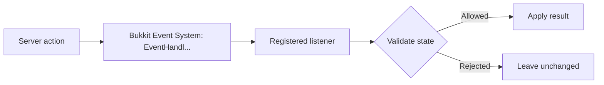

The Bukkit event system lets your plugin react to things that happen on the server — players joining, blocks breaking, entities spawning, and much more — without modifying server internals. You write a listener class, annotate handler methods with `@EventHandler`, and register the listener with the `PluginManager`. Bukkit then calls your methods automatically whenever matching events fire. This reference covers every core class and interface you need to work with the event system, including how to define your own custom events.

{/* visual-map:start */}
## Visual map


{/* visual-map:end */}

---

## The `Event` Abstract Class

Every event in Bukkit extends `org.bukkit.event.Event`. You interact with this base class when you are building custom events or when you need to inspect an event generically.

<ResponseField name="getEventName()" type="@NotNull String">
  Returns a human-readable name for this event. By default, this is the event's class simple name (e.g. `"PlayerJoinEvent"`). You can override this in a custom event to provide a more descriptive name.
</ResponseField>

<ResponseField name="isAsynchronous()" type="final boolean">
  Returns `true` if this event was fired from an asynchronous context (i.e. a background thread). Asynchronous events have additional constraints: you must not call Bukkit API methods from their handlers, and you cannot fire a synchronous event from within an async event handler.
</ResponseField>

<Note>
  An event's async status is set at construction time and cannot be changed afterwards. You declare an async event by passing `true` to the `Event(boolean isAsync)` constructor when you create the event.
</Note>

---

## The `@EventHandler` Annotation

You place `@EventHandler` on any `public void` method inside a class that implements `Listener`. The method must accept exactly one parameter: the specific event subtype you want to handle.

```java
@EventHandler
public void onPlayerJoin(PlayerJoinEvent event) {
    event.getPlayer().sendMessage("Welcome to the server!");
}
```

`@EventHandler` has two optional fields:

<ResponseField name="priority" type="EventPriority">
  Controls when your handler is called relative to other handlers for the same event. Defaults to `EventPriority.NORMAL`. See the [EventPriority table](#eventpriority-enum) below for the full execution order.
</ResponseField>

<ResponseField name="ignoreCancelled" type="boolean">
  When set to `true`, Bukkit will not invoke your handler if the event has already been cancelled by an earlier handler. Defaults to `false`, meaning your handler is called regardless of cancellation state.

  Use `ignoreCancelled = true` whenever your handler only needs to act on events that will actually take effect.
</ResponseField>

```java title="Using priority and ignoreCancelled"
@EventHandler(priority = EventPriority.HIGH, ignoreCancelled = true)
public void onBlockBreak(BlockBreakEvent event) {
    // Only called if no earlier handler has cancelled the event
    event.getPlayer().sendMessage("You broke a block!");
}
```

---

## `EventPriority` Enum

Handlers for the same event type are called in priority order from `LOWEST` to `MONITOR`. A lower priority value means your handler runs earlier.

| Priority | Slot | When to Use |
|---|---|---|
| `LOWEST` | 0 | Your plugin wants to observe the event first, before anyone else acts on it. Rarely used for modifications. |
| `LOW` | 1 | Your plugin has a weak opinion about the outcome and wants to be overridden by most others. |
| `NORMAL` | 2 | The default. Use this for typical event handling where ordering relative to other plugins is not critical. |
| `HIGH` | 3 | Your plugin has a strong opinion about the outcome that should override `NORMAL` handlers. |
| `HIGHEST` | 4 | Your plugin must have the final word on whether the event proceeds. |
| `MONITOR` | 5 | **Read-only observation only.** Your handler reads the final outcome but must not change it. Useful for logging and statistics. |

<Warning>
  Never modify event state (such as calling `setCancelled()`) in a `MONITOR` handler. The `MONITOR` priority exists solely for observing the resolved outcome of an event after all other handlers have run.
</Warning>

---

## The `Cancellable` Interface

Events that can be prevented from taking effect implement `org.bukkit.event.Cancellable`. Check this interface before calling cancel-related methods — not every event is cancellable.

<ResponseField name="isCancelled()" type="boolean">
  Returns the current cancellation state. A cancelled event will not be executed by the server, but it will continue to pass through handlers at higher priority levels (unless those handlers set `ignoreCancelled = true`).
</ResponseField>

<ResponseField name="setCancelled(boolean cancel)" type="void">
  Sets the cancellation state of the event.

  <ParamField path="cancel" type="boolean" required>
    Pass `true` to cancel the event and prevent the server from taking the associated action. Pass `false` to un-cancel an event that was cancelled by an earlier handler.
  </ParamField>
</ResponseField>

```java title="Preventing block break in protected regions"
@EventHandler(priority = EventPriority.HIGH, ignoreCancelled = true)
public void onBlockBreak(BlockBreakEvent event) {
    if (isProtected(event.getBlock().getLocation())) {
        event.setCancelled(true);
        event.getPlayer().sendMessage("This area is protected.");
    }
}
```

---

## The `Listener` Interface

`org.bukkit.event.Listener` is a marker interface with no methods. Your listener class implements it to signal to Bukkit that it contains `@EventHandler` methods. You register your listener once using `PluginManager.registerEvents()`.

```java title="Registering a listener"
getServer().getPluginManager().registerEvents(new MyListener(), this);
```

---

## Creating a Custom Event

To define your own event, you need to:

1. Extend `org.bukkit.event.Event`.
2. Declare a `static final HandlerList` field.
3. Override `getHandlers()` to return the `HandlerList`.
4. Add a `static getHandlerList()` method — Bukkit's reflection-based registration requires this exact signature.
5. Optionally implement `Cancellable` if other plugins should be able to prevent the event's effect.

```java title="Complete custom event example"
package com.example.myplugin.event;

import org.bukkit.entity.Player;
import org.bukkit.event.Cancellable;
import org.bukkit.event.Event;
import org.bukkit.event.HandlerList;
import org.jetbrains.annotations.NotNull;

/**
 * Fired when a player earns a reward in your plugin's minigame.
 */
public class PlayerRewardEvent extends Event implements Cancellable {

    // Every custom event must have a static HandlerList
    private static final HandlerList HANDLERS = new HandlerList();

    private final Player player;
    private int rewardAmount;
    private boolean cancelled;

    public PlayerRewardEvent(@NotNull Player player, int rewardAmount) {
        this.player = player;
        this.rewardAmount = rewardAmount;
        this.cancelled = false;
    }

    // --- Getters and setters for your custom data ---

    @NotNull
    public Player getPlayer() {
        return player;
    }

    public int getRewardAmount() {
        return rewardAmount;
    }

    public void setRewardAmount(int amount) {
        this.rewardAmount = amount;
    }

    // --- Cancellable implementation ---

    @Override
    public boolean isCancelled() {
        return cancelled;
    }

    @Override
    public void setCancelled(boolean cancel) {
        this.cancelled = cancel;
    }

    // --- Required HandlerList boilerplate ---

    @Override
    @NotNull
    public HandlerList getHandlers() {
        return HANDLERS;
    }

    // Bukkit's registration system calls this static method via reflection
    @NotNull
    public static HandlerList getHandlerList() {
        return HANDLERS;
    }
}
```

Once defined, you fire your event using `PluginManager.callEvent()` and then check whether it was cancelled before acting:

```java title="Firing a custom event"
PlayerRewardEvent rewardEvent = new PlayerRewardEvent(player, 100);
Bukkit.getPluginManager().callEvent(rewardEvent);

if (!rewardEvent.isCancelled()) {
    giveCoins(player, rewardEvent.getRewardAmount());
}
```

Other plugins can listen to your event using the same `@EventHandler` mechanism:

```java title="Listening to a custom event"
@EventHandler
public void onPlayerReward(PlayerRewardEvent event) {
    plugin.getLogger().info(
        event.getPlayer().getName() + " earned " + event.getRewardAmount() + " coins."
    );
}
```

<Tip>
  Always document the conditions under which you fire a custom event and what cancelling it means. Other plugin authors who integrate with your plugin will rely on this contract.
</Tip>
