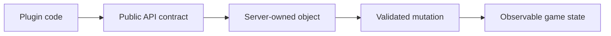

When Bukkit loads your plugin, it parses your `plugin.yml` and makes all of that information available at runtime through a `PluginDescriptionFile` instance. You obtain this object by calling `getDescription()` on your plugin — for example, `this.getDescription()` from inside a `JavaPlugin` subclass. Every method on `PluginDescriptionFile` maps directly to a key in your `plugin.yml`, so this page is both a runtime API reference and a guide to what each YAML field means in practice.

{/* visual-map:start */}
## Visual map


{/* visual-map:end */}

<Note>
  Three fields are **required** in every `plugin.yml`: `name`, `version`, and
  `main`. Bukkit refuses to load a plugin that omits any of them, and
  `PluginDescriptionFile` will throw `InvalidDescriptionException` during
  parsing if they are missing.
</Note>

---

## Identity

These methods expose the human-visible metadata that identifies your plugin on the server and to players.

<ResponseField name="getName()" type="String" required>
  Returns the plugin's unique name as declared in the `name` field of
  `plugin.yml`. The server uses this name for the data folder, command
  namespacing, and dependency resolution. Names are case-sensitive for
  dependency matching — `"MyPlugin"` and `"myplugin"` are treated as
  different plugins.

  ```yaml title="plugin.yml"
  name: Inferno
  ```
</ResponseField>

<ResponseField name="getVersion()" type="String" required>
  Returns the version string declared in `version`. Bukkit imposes no format on
  this string — you can use semver, a date, a build number, or any other scheme.
  The value is displayed in `/version <plugin>` output.

  ```yaml title="plugin.yml"
  version: 2.4.1
  ```
</ResponseField>

<ResponseField name="getDescription()" type="String" required>
  Returns the human-readable summary from the `description` field, or `null` if
  the field was omitted. This text appears in plugin list commands and on plugin
  hosting sites.

  ```yaml title="plugin.yml"
  description: This plugin is so 31337. You can set yourself on fire.
  ```
</ResponseField>

<ResponseField name="getWebsite()" type="String" required>
  Returns the URL from the `website` field, or `null` if not set. Point this at
  your documentation site, GitHub repository, or forum thread.

  ```yaml title="plugin.yml"
  website: https://github.com/example/inferno
  ```
</ResponseField>

<ResponseField name="getAuthors()" type="List&lt;String&gt;" required>
  Returns an immutable list of author names from the `author` and/or `authors`
  fields. You can declare a single author with `author: YourName` or a list with
  `authors: [Alice, Bob]`. Both forms are merged into one list at parse time.

  ```yaml title="plugin.yml"
  author: CaptainInflamo
  authors: [Cogito, verrier, EvilSeph]
  ```
</ResponseField>

<ResponseField name="getContributors()" type="List&lt;String&gt;" required>
  Returns an immutable list of contributor names from the `contributors` field.
  Use this for people who made meaningful contributions but are not the project
  leads listed in `authors`.

  ```yaml title="plugin.yml"
  contributors: [Choco, md_5]
  ```
</ResponseField>

<ResponseField name="getFullName()" type="String" required>
  Returns a display-friendly string in the form `"<name> v<version>"` — for
  example, `"Inferno v1.4.1"`. This is a computed value with no corresponding
  YAML field; `JavaPlugin.toString()` delegates to this method.
</ResponseField>

---

## Entry Point

<ResponseField name="getMain()" type="String" required>
  Returns the fully-qualified class name of your plugin's main class, as
  declared in the `main` field. This is the class Bukkit instantiates when your
  plugin loads. It must extend `JavaPlugin` and reside inside your JAR.

  ```yaml title="plugin.yml"
  main: com.captaininflamo.bukkit.inferno.Inferno
  ```

  You almost never need to read this at runtime, but it is available when you
  want to log or display the plugin's entry point.
</ResponseField>

---

## API Version

<ResponseField name="getAPIVersion()" type="String" required>
  Returns the `api-version` value from `plugin.yml`, or `null` if the field was
  omitted. This string tells Bukkit which API version your plugin was compiled
  against, which controls certain compatibility checks and enables modern
  features like `BLOCK_DATA` materials.

  ```yaml title="plugin.yml"
  api-version: 1.20
  ```

  <Warning>
    Omitting `api-version` causes Bukkit to treat your plugin as a legacy plugin
    and may suppress certain API features or produce deprecation warnings in the
    server console. Always set this field in new plugins.
  </Warning>
</ResponseField>

---

## Dependencies

These methods expose the three dependency lists that Bukkit reads to determine plugin load order and hard requirements.

<ResponseField name="getDepend()" type="List&lt;String&gt;" required>
  Returns an immutable list of plugin names from the `depend` field. Every name
  in this list is a **hard dependency** — if any listed plugin is absent or
  fails to load, Bukkit refuses to load your plugin at all.

  ```yaml title="plugin.yml"
  depend: [NewFire, FlameWire]
  ```
</ResponseField>

<ResponseField name="getSoftDepend()" type="List&lt;String&gt;" required>
  Returns an immutable list of plugin names from the `softdepend` field.
  Soft-dependency plugins are loaded before yours **if they are present**, but
  their absence does not prevent your plugin from loading. Use this when you
  want to integrate with another plugin's API only when that plugin is
  installed.

  ```yaml title="plugin.yml"
  softdepend: [Vault, PlaceholderAPI]
  ```

  ```java title="Conditional Vault integration"
  if (getServer().getPluginManager().isPluginEnabled("Vault")) {
      setupEconomy();
  }
  ```
</ResponseField>

<ResponseField name="getLoadBefore()" type="List&lt;String&gt;" required>
  Returns an immutable list of plugin names from the `loadbefore` field. This is
  the inverse of `softdepend`: it requests that your plugin load **before** each
  named plugin, without creating a hard requirement. Useful when you provide an
  API that other plugins may optionally build on.

  ```yaml title="plugin.yml"
  loadbefore: [SomeConsumerPlugin]
  ```
</ResponseField>

---

## Commands

<ResponseField name="getCommands()" type="Map&lt;String, Map&lt;String, Object&gt;&gt;" required>
  Returns an immutable map of every command declared in the `commands` block of
  `plugin.yml`. The outer map key is the command name; the inner map contains
  its configuration: `description`, `aliases`, `permission`, `usage`, and any
  other keys you declared.

  ```yaml title="plugin.yml"
  commands:
    flagrate:
      description: Set yourself on fire.
      aliases: [combust_me, combustMe]
      permission: inferno.flagrate
      usage: /flagrate
    burningdeaths:
      description: List how many times you have died by fire.
      permission: inferno.burningdeaths
      usage: /burningdeaths [player]
  ```

  ```java title="Iterating declared commands at runtime"
  for (Map.Entry<String, Map<String, Object>> entry : getDescription().getCommands().entrySet()) {
      getLogger().info("Registered command: " + entry.getKey());
  }
  ```

  <Tip>
    To attach executors and tab completers to these commands at runtime, use
    `JavaPlugin.getCommand(String)` rather than reading this map directly.
  </Tip>
</ResponseField>

---

## Permissions

<ResponseField name="getPermissions()" type="List&lt;Permission&gt;" required>
  Returns an immutable list of `Permission` objects parsed from the `permissions`
  block of `plugin.yml`. Bukkit registers these permissions with the server
  automatically when your plugin loads, so you rarely need to call this method
  yourself.

  ```yaml title="plugin.yml"
  permissions:
    inferno.*:
      description: Gives access to all Inferno commands
      children:
        inferno.flagrate: true
        inferno.burningdeaths: true
    inferno.flagrate:
      description: Allows you to ignite yourself
      default: true
    inferno.burningdeaths:
      description: Allows you to see your fire death count
      default: true
  ```

  Read these at runtime when you need to enumerate your plugin's declared
  permissions — for example, to build a help or permissions listing command.
</ResponseField>

<ResponseField name="getPermissionDefault()" type="PermissionDefault" required>
  Returns the `PermissionDefault` value from the `default-permission` field.
  This is the fallback default applied to every permission defined in the
  `permissions` block that does not declare its own `default` key. Returns
  `PermissionDefault.OP` when the field is absent.

  ```yaml title="plugin.yml"
  default-permission: not op
  ```
</ResponseField>

---

## Provides, Libraries, and Log Prefix

These three optional fields give you runtime access to API aliases, bundled library declarations, and the logging prefix your plugin uses in the server console.

<ResponseField name="getProvides()" type="List&lt;String&gt;" required>
  Returns an immutable list of API aliases this plugin declares via the `provides`
  field. Other plugins can list one of these aliases in their `depend` or
  `softdepend` lists and Bukkit will treat this plugin as satisfying that
  dependency, even if the real plugin name is different. Returns an empty list
  when the field is omitted.

  ```yaml title="plugin.yml"
  provides: [Hell]
  ```

  ```java title="Reading the provides list at runtime"
  List<String> aliases = getDescription().getProvides();
  getLogger().info("This plugin provides: " + aliases);
  ```
</ResponseField>

<ResponseField name="getLibraries()" type="List&lt;String&gt;" required>
  Returns an immutable list of Maven coordinate strings from the `libraries`
  field. Bukkit's plugin loader downloads and adds these JARs to the plugin's
  classpath at startup, letting you use third-party libraries without shading
  them into your JAR. Returns an empty list when the field is omitted.

  ```yaml title="plugin.yml"
  libraries:
    - com.squareup.okhttp3:okhttp:4.9.0
  ```
</ResponseField>

<ResponseField name="getPrefix()" type="String" required>
  Returns the string from the `prefix` field, or `null` if the field was omitted.
  When set, this value replaces the plugin's name as the prefix on all log
  messages produced by `getLogger()`. Use it when your plugin's actual name is
  long and you want shorter console output.

  ```yaml title="plugin.yml"
  prefix: ex-why-zee
  ```
</ResponseField>

---

## Load Order

<ResponseField name="getLoad()" type="PluginLoadOrder" required>
  Returns the `PluginLoadOrder` enum value from the `load` field. The two
  possible values are:

  | Value | When it loads |
  |---|---|
  | `STARTUP` | Before the first world is loaded — use for world generators |
  | `POSTWORLD` | After all worlds are loaded (the default) |

  ```yaml title="plugin.yml"
  load: STARTUP
  ```

  <Note>
    Most plugins should omit the `load` field entirely, which defaults to
    `POSTWORLD`. Only set it to `STARTUP` if you are providing a custom
    `ChunkGenerator` or `BiomeProvider` and must be registered before world
    generation begins.
  </Note>
</ResponseField>

---

## Quick-Reference Table

| Method | Return type | `plugin.yml` key | Notes |
|---|---|---|---|
| `getName()` | `String` | `name` | Required |
| `getVersion()` | `String` | `version` | Required |
| `getMain()` | `String` | `main` | Required |
| `getDescription()` | `String` | `description` | Nullable |
| `getWebsite()` | `String` | `website` | Nullable |
| `getAuthors()` | `List<String>` | `author` / `authors` | Never null |
| `getContributors()` | `List<String>` | `contributors` | Never null |
| `getFullName()` | `String` | *(computed)* | `"<name> v<version>"` |
| `getAPIVersion()` | `String` | `api-version` | Nullable |
| `getDepend()` | `List<String>` | `depend` | Never null |
| `getSoftDepend()` | `List<String>` | `softdepend` | Never null |
| `getLoadBefore()` | `List<String>` | `loadbefore` | Never null |
| `getCommands()` | `Map<String, Map<String, Object>>` | `commands` | Never null |
| `getPermissions()` | `List<Permission>` | `permissions` | Never null |
| `getPermissionDefault()` | `PermissionDefault` | `default-permission` | Defaults to `OP` |
| `getLoad()` | `PluginLoadOrder` | `load` | Defaults to `POSTWORLD` |
| `getProvides()` | `List<String>` | `provides` | API aliases this plugin provides |
| `getLibraries()` | `List<String>` | `libraries` | Maven coordinates for runtime libs |
| `getPrefix()` | `String` | `prefix` | Nullable; overrides log prefix |
