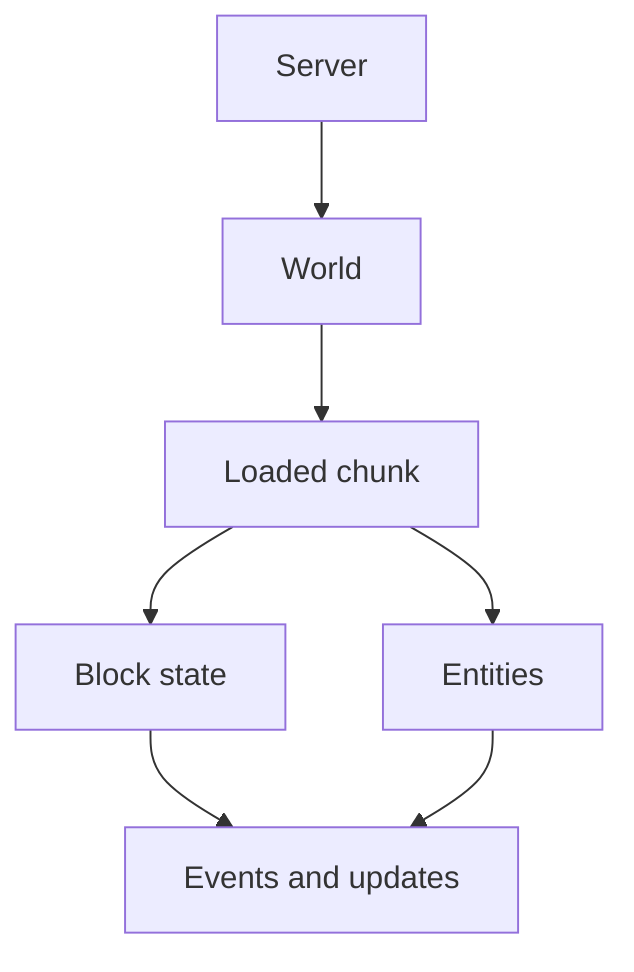

The `World` interface represents a single Minecraft dimension — the overworld, the Nether, the End, or any custom world your plugin creates. Through it you can read and write individual blocks, spawn and query entities, adjust weather and time, play effects, and manage the chunks that make up the terrain. Every `Player`, `Entity`, and `Block` belongs to a `World`, so you will use this interface constantly wherever location-sensitive logic is needed.

{/* visual-map:start */}
## Visual map


{/* visual-map:end */}

---

## Block Access

These methods let you retrieve `Block` objects at specific coordinates. A `Block` reference lets you inspect and change its type, data, and attached tile-entity state.

<ResponseField name="getBlockAt(int x, int y, int z)" type="@NotNull Block">
  Returns the block at the given world coordinates. The block is loaded on demand if the chunk containing it is not already in memory.

  <ParamField path="x" type="int" required>World X coordinate.</ParamField>
  <ParamField path="y" type="int" required>World Y coordinate (within the world's height range).</ParamField>
  <ParamField path="z" type="int" required>World Z coordinate.</ParamField>
</ResponseField>

<ResponseField name="getBlockAt(Location location)" type="@NotNull Block">
  Returns the block at the coordinates encoded in a `Location` object. The `Location`'s world is ignored; only the x/y/z values are used.

  <ParamField path="location" type="Location" required>
    The location whose block-coordinate components are used.
  </ParamField>
</ResponseField>

<ResponseField name="getHighestBlockAt(int x, int z)" type="@NotNull Block">
  Returns the highest non-empty (impassable) block in the column at the given x/z. Useful for placing items on the surface of natural terrain.

  <ParamField path="x" type="int" required>World X coordinate.</ParamField>
  <ParamField path="z" type="int" required>World Z coordinate.</ParamField>
</ResponseField>

```java title="Placing a torch on the highest surface block"
Block surface = world.getHighestBlockAt(100, 64);
Block above = world.getBlockAt(surface.getX(), surface.getY() + 1, surface.getZ());
above.setType(Material.TORCH);
```

---

## Entity Spawning

<ResponseField name="spawnEntity(Location location, EntityType type)" type="@NotNull Entity">
  Spawns an entity of the given type at the specified location. The returned `Entity` is already added to the world and can be cast to the appropriate subtype.

  <ParamField path="location" type="Location" required>
    The exact position and facing angle at which to spawn the entity.
  </ParamField>
  <ParamField path="type" type="EntityType" required>
    The type of entity to spawn (e.g. `EntityType.ZOMBIE`, `EntityType.ARROW`).
  </ParamField>
</ResponseField>

<ResponseField name="getNearbyEntities(Location location, double x, double y, double z)" type="@NotNull Collection<Entity>">
  Returns all entities within a bounding box centred on `location`. The box half-extents are `x`, `y`, and `z` in their respective axes. The collection is not live and will not reflect subsequent changes.

  <ParamField path="location" type="Location" required>Centre of the search area.</ParamField>
  <ParamField path="x" type="double" required>Half-width of the search box along the X axis.</ParamField>
  <ParamField path="y" type="double" required>Half-height of the search box along the Y axis.</ParamField>
  <ParamField path="z" type="double" required>Half-depth of the search box along the Z axis.</ParamField>
</ResponseField>

```java title="Spawning a zombie and knocking back nearby entities"
Entity zombie = world.spawnEntity(spawnLoc, EntityType.ZOMBIE);

for (Entity nearby : world.getNearbyEntities(spawnLoc, 5, 5, 5)) {
    if (nearby instanceof LivingEntity living) {
        living.damage(2.0, zombie);
    }
}
```

---

## Time and Weather

<ResponseField name="getTime()" type="long">
  Returns the relative in-game time for this world (0–23999). This value wraps every day and represents the position of the sun independent of the full day count.
</ResponseField>

<ResponseField name="setTime(long time)" type="void">
  Sets the relative in-game time. Values from 0 to 23999 represent one full day cycle; values outside this range wrap automatically.

  <ParamField path="time" type="long" required>
    The new relative time (0 = dawn, 6000 = noon, 12000 = dusk, 18000 = midnight).
  </ParamField>
</ResponseField>

<ResponseField name="setStorm(boolean hasStorm)" type="void">
  Enables or disables rain and snow in this world.

  <ParamField path="hasStorm" type="boolean" required>
    `true` to start precipitation, `false` to clear it.
  </ParamField>
</ResponseField>

<ResponseField name="setThundering(boolean thundering)" type="void">
  Enables or disables thunderstorms. Thundering only has a visible effect when a storm is also active.

  <ParamField path="thundering" type="boolean" required>
    `true` to enable lightning, `false` to disable it.
  </ParamField>
</ResponseField>

<ResponseField name="getWeatherDuration()" type="int">
  Returns the number of ticks remaining in the current weather state (storm or clear). When this value reaches zero, the server selects a new weather state randomly.
</ResponseField>

```java title="Forcing a thunderstorm for 5 minutes"
world.setStorm(true);
world.setThundering(true);
// 5 minutes × 60 seconds × 20 ticks/sec = 6000 ticks
world.setWeatherDuration(6000);
world.setThunderDuration(6000);
```

<Note>
  Time and weather changes apply only to the specific `World` instance you call them on. Other loaded worlds are unaffected.
</Note>

---

## World Properties

<ResponseField name="getName()" type="String">
  Returns the name of this world, matching the folder name on disk (e.g. `"world"`, `"world_nether"`).
</ResponseField>

<ResponseField name="getUID()" type="UUID">
  Returns the universally unique identifier assigned to this world. The UID persists across server restarts and uniquely distinguishes worlds even if they share a name.
</ResponseField>

<ResponseField name="getEnvironment()" type="World.Environment">
  Returns the dimension type of this world: `NORMAL`, `NETHER`, or `THE_END`. See the [environments table](#world-environments) below.
</ResponseField>

<ResponseField name="getSpawnLocation()" type="@NotNull Location">
  Returns the world's default spawn point, where new players first appear and where `/spawn` typically teleports players.
</ResponseField>

<ResponseField name="setSpawnLocation(Location location)" type="boolean">
  Moves the world spawn to the given location. Returns `true` if the change succeeded.

  <ParamField path="location" type="Location" required>
    The new spawn location. The world of the `Location` must match this world.
  </ParamField>
</ResponseField>

---

## Players in this World

<ResponseField name="getPlayers()" type="@NotNull List<Player>">
  Returns a snapshot list of every player currently online in this specific world. Unlike `Server.getOnlinePlayers()`, this list is scoped to a single dimension.
</ResponseField>

```java title="Announcing to players in one world"
for (Player p : world.getPlayers()) {
    p.sendMessage(ChatColor.GOLD + "A boss has spawned nearby!");
}
```

---

## Chunk Operations

<ResponseField name="getChunkAt(int x, int z)" type="@NotNull Chunk">
  Returns the chunk at the given chunk coordinates (not block coordinates — divide block x/z by 16). The chunk is loaded from disk or generated if not already in memory.

  <ParamField path="x" type="int" required>Chunk X coordinate.</ParamField>
  <ParamField path="z" type="int" required>Chunk Z coordinate.</ParamField>
</ResponseField>

<ResponseField name="isChunkLoaded(Chunk chunk)" type="boolean">
  Returns `true` if the given chunk is currently held in memory.

  <ParamField path="chunk" type="Chunk" required>The chunk to test.</ParamField>
</ResponseField>

<ResponseField name="loadChunk(int x, int z)" type="void">
  Forces the chunk at the given coordinates into memory. The chunk remains loaded until you call an unload method explicitly. For short-lived access, prefer `getChunkAt()` which does not pin the chunk in memory.

  <ParamField path="x" type="int" required>Chunk X coordinate.</ParamField>
  <ParamField path="z" type="int" required>Chunk Z coordinate.</ParamField>
</ResponseField>

<ResponseField name="unloadChunk(int x, int z)" type="boolean">
  Requests that the server unload the specified chunk. Returns `true` if the chunk was successfully unloaded. The chunk is saved to disk before removal.

  <ParamField path="x" type="int" required>Chunk X coordinate.</ParamField>
  <ParamField path="z" type="int" required>Chunk Z coordinate.</ParamField>
</ResponseField>

<Warning>
  Calling `loadChunk()` without a matching `unloadChunk()` (or without using plugin chunk tickets) keeps the chunk pinned in memory indefinitely. Always pair forced loads with an appropriate release strategy.
</Warning>

---

## Visual and Audio Effects

<ResponseField name="spawnParticle(Particle particle, Location location, int count)" type="void">
  Spawns the given particle effect at `location` for all players in range.

  <ParamField path="particle" type="Particle" required>The particle type to spawn.</ParamField>
  <ParamField path="location" type="Location" required>The world position at which to emit particles.</ParamField>
  <ParamField path="count" type="int" required>The number of individual particles to emit.</ParamField>
</ResponseField>

<ResponseField name="playSound(Location location, Sound sound, float volume, float pitch)" type="void">
  Plays a sound at the given location, audible to all players within range.

  <ParamField path="location" type="Location" required>The origin of the sound.</ParamField>
  <ParamField path="sound" type="Sound" required>The sound to play (e.g. `Sound.ENTITY_PLAYER_LEVELUP`).</ParamField>
  <ParamField path="volume" type="float" required>The volume multiplier. Values above `1.0f` increase the audible radius.</ParamField>
  <ParamField path="pitch" type="float" required>The pitch multiplier. `1.0f` is normal pitch; `0.5f` is an octave lower.</ParamField>
</ResponseField>

<ResponseField name="strikeLightning(Location loc)" type="@NotNull LightningStrike">
  Spawns a lightning bolt at the given location that deals damage and can ignite flammable blocks. Returns the `LightningStrike` entity.

  <ParamField path="loc" type="Location" required>The position at which the lightning strikes.</ParamField>
</ResponseField>

```java title="Playing an effect at the player's location"
world.spawnParticle(Particle.EXPLOSION_EMITTER, player.getLocation(), 10);
world.playSound(player.getLocation(), Sound.ENTITY_GENERIC_EXPLODE, 1.0f, 1.0f);
```

---

## World Environments

The `World.Environment` enum classifies which dimension type a world represents. You set this when creating a world and read it back via `getEnvironment()`.

| Value | ID | Description |
|---|---|---|
| `NORMAL` | `0` | The standard overworld with surface terrain, sky, and day/night cycles. |
| `NETHER` | `-1` | The Nether dimension — enclosed, no sky, different mob spawning rules. |
| `THE_END` | `1` | The End dimension — floating islands, no weather, endermen and the Ender Dragon. |
