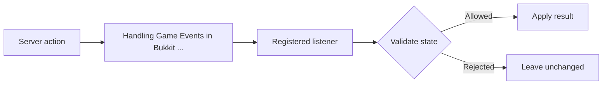

Bukkit's event system is the primary way your plugin reacts to what happens on the server. Whenever something occurs in the game — a player joining, a block being broken, a creature spawning — the server fires a corresponding `Event` object and calls every registered handler in priority order. By implementing the `Listener` interface and annotating your methods with `@EventHandler`, you can intercept these moments, read their data, and in many cases cancel or modify the outcome entirely.

{/* visual-map:start */}
## Visual map


{/* visual-map:end */}

## How Events Work

When an in-game action occurs, Bukkit creates an event object that carries all relevant context (the player involved, the block that was broken, the damage amount, etc.) and passes it to the `PluginManager`, which dispatches it to all registered listeners sorted by `EventPriority`. Listeners run synchronously on the main server thread unless the event class is marked async.

The flow looks like this:

1. Game action occurs (player joins, block breaks, etc.)
2. Server instantiates the relevant `Event` subclass
3. `PluginManager` calls all registered `@EventHandler` methods, lowest priority first
4. If the event implements `Cancellable` and any listener cancels it, the server suppresses the action

## Creating a Listener

To listen for events you need to:

1. Create a class that implements `org.bukkit.event.Listener`
2. Add a public method that accepts the specific event type as its only parameter
3. Annotate that method with `@EventHandler`

```java PlayerJoinListener.java
package com.example.myplugin;

import org.bukkit.event.EventHandler;
import org.bukkit.event.Listener;
import org.bukkit.event.player.PlayerJoinEvent;

public class PlayerJoinListener implements Listener {

    @EventHandler
    public void onPlayerJoin(PlayerJoinEvent event) {
        // Customize the join message
        event.setJoinMessage("§a» " + event.getPlayer().getName() + " joined the server!");
    }
}
```

The method name does not matter — Bukkit identifies handler methods purely by the `@EventHandler` annotation and the event type declared in the parameter.

## Event Priority

When multiple plugins (or multiple listeners within one plugin) handle the same event, Bukkit calls them in the order defined by `EventPriority`. Lower-priority handlers run first, giving higher-priority handlers the final word.

| Priority | Slot | Intended use |
|---|---|---|
| `LOWEST` | 0 | First to run; make tentative changes that others can override |
| `LOW` | 1 | Early processing; your opinion matters less than most |
| `NORMAL` | 2 | **Default.** Most plugins should use this value |
| `HIGH` | 3 | Your plugin has a strong opinion about the outcome |
| `HIGHEST` | 4 | Critical logic that should override most other plugins |
| `MONITOR` | 5 | **Read-only observation only.** Never modify the event here |

```java PriorityExample.java
import org.bukkit.event.EventHandler;
import org.bukkit.event.EventPriority;
import org.bukkit.event.Listener;
import org.bukkit.event.player.PlayerJoinEvent;

public class PriorityExample implements Listener {

    // Runs first — make an early suggestion
    @EventHandler(priority = EventPriority.LOWEST)
    public void onJoinEarly(PlayerJoinEvent event) {
        event.setJoinMessage("Hello, " + event.getPlayer().getName());
    }

    // Runs last — only log the final outcome, do NOT change anything
    @EventHandler(priority = EventPriority.MONITOR)
    public void onJoinMonitor(PlayerJoinEvent event) {
        System.out.println("Final join message: " + event.getJoinMessage());
    }
}
```

<Warning>
  Never modify an event's outcome inside a `MONITOR` handler. The purpose of `MONITOR` is purely to observe the final, settled state of an event (for example, to write audit logs). Changing data at `MONITOR` priority can cause hard-to-debug inconsistencies.
</Warning>

## Cancelling Events

Events that implement `org.bukkit.event.Cancellable` can be suppressed before the server processes them. Call `setCancelled(true)` on the event to prevent the default action.

```java BlockProtectionListener.java
import org.bukkit.event.EventHandler;
import org.bukkit.event.Listener;
import org.bukkit.event.block.BlockBreakEvent;

public class BlockProtectionListener implements Listener {

    @EventHandler
    public void onBlockBreak(BlockBreakEvent event) {
        // Deny block breaking if the player lacks the required permission
        if (!event.getPlayer().hasPermission("myplugin.build")) {
            event.setCancelled(true);
            event.getPlayer().sendMessage("§cYou don't have permission to break blocks here.");
        }
    }
}
```

### The `ignoreCancelled` flag

By default, your handler is called even if a previous listener has already cancelled the event. If your logic should only run when the event is still active, set `ignoreCancelled = true`:

```java IgnoreCancelledExample.java
@EventHandler(ignoreCancelled = true)
public void onBlockBreak(BlockBreakEvent event) {
    // This method is skipped entirely if another plugin already cancelled the event
    rewardPlayer(event.getPlayer());
}
```

<Tip>
  Use `ignoreCancelled = true` on most of your handlers. It avoids running unnecessary logic and prevents your plugin from undoing a cancellation that another plugin deliberately set.
</Tip>

## Registering a Listener

A listener class does nothing until you register it with the server's `PluginManager`. Do this inside your plugin's `onEnable()` method:

```java MyPlugin.java
import org.bukkit.plugin.java.JavaPlugin;

public final class MyPlugin extends JavaPlugin {

    @Override
    public void onEnable() {
        // Pass an instance of your listener and a reference to this plugin
        getServer().getPluginManager().registerEvents(new PlayerJoinListener(), this);
        getServer().getPluginManager().registerEvents(new BlockProtectionListener(), this);
    }
}
```

Bukkit automatically unregisters all of your plugin's listeners when the plugin is disabled, so you do not need to unregister them manually in `onDisable()`.

## Common Events by Category

<CardGroup cols={2}>
  <Card title="Player Events" icon="person">
    | Class | Fires when… |
    |---|---|
    | `PlayerJoinEvent` | A player connects to the server |
    | `PlayerQuitEvent` | A player disconnects |
    | `PlayerMoveEvent` | A player's position changes |
    | `PlayerInteractEvent` | A player right- or left-clicks a block/air |
    | `PlayerCommandPreprocessEvent` | A player runs a command |
    | `PlayerRespawnEvent` | A player respawns after death |
    | `PlayerTeleportEvent` | A player teleports |
    | `AsyncPlayerChatEvent` | Chat message (fires off main thread) |
  </Card>
  <Card title="Block Events" icon="cube">
    | Class | Fires when… |
    |---|---|
    | `BlockBreakEvent` | A player breaks a block |
    | `BlockPlaceEvent` | A player places a block |
    | `BlockBurnEvent` | A block burns from fire |
    | `BlockExplodeEvent` | An explosion destroys a block |
    | `BlockIgniteEvent` | A block catches fire |
    | `BlockGrowEvent` | A block grows (e.g., crop) |
    | `BlockRedstoneEvent` | Redstone power level changes |
    | `BlockPistonExtendEvent` | A piston extends |
  </Card>
  <Card title="Entity Events" icon="dragon">
    | Class | Fires when… |
    |---|---|
    | `EntityDamageEvent` | Any entity takes damage |
    | `EntityDamageByEntityEvent` | An entity damages another entity |
    | `EntityDeathEvent` | An entity dies |
    | `CreatureSpawnEvent` | A creature spawns |
    | `EntityExplodeEvent` | An entity explodes (e.g., Creeper) |
    | `EntityInteractEvent` | An entity interacts with a block |
  </Card>
  <Card title="World Events" icon="earth-americas">
    | Class | Fires when… |
    |---|---|
    | `WorldLoadEvent` | A world is loaded |
    | `WorldUnloadEvent` | A world is unloaded |
    | `WorldSaveEvent` | A world is saved to disk |
    | `ChunkLoadEvent` | A chunk is loaded |
    | `ChunkUnloadEvent` | A chunk is unloaded |
    | `StructureGrowEvent` | A tree or mushroom grows |
    | `PortalCreateEvent` | A portal is created |
  </Card>
</CardGroup>

## Complete Example

The following example shows a full listener that welcomes players, logs quits, and protects blocks from players who lack a build permission:

```java MyListener.java
package com.example.myplugin;

import org.bukkit.event.EventHandler;
import org.bukkit.event.EventPriority;
import org.bukkit.event.Listener;
import org.bukkit.event.block.BlockBreakEvent;
import org.bukkit.event.player.PlayerJoinEvent;
import org.bukkit.event.player.PlayerQuitEvent;

public class MyListener implements Listener {

    @EventHandler
    public void onPlayerJoin(PlayerJoinEvent event) {
        event.setJoinMessage("§a[+] §f" + event.getPlayer().getName());
        event.getPlayer().sendMessage("§eWelcome back, " + event.getPlayer().getName() + "!");
    }

    @EventHandler
    public void onPlayerQuit(PlayerQuitEvent event) {
        event.setQuitMessage("§c[-] §f" + event.getPlayer().getName());
    }

    @EventHandler(priority = EventPriority.HIGH, ignoreCancelled = true)
    public void onBlockBreak(BlockBreakEvent event) {
        if (!event.getPlayer().hasPermission("myplugin.build")) {
            event.setCancelled(true);
            event.getPlayer().sendMessage("§cYou cannot break blocks here.");
        }
    }
}
```

Register it in `onEnable()`:

```java MyPlugin.java (onEnable)
@Override
public void onEnable() {
    getServer().getPluginManager().registerEvents(new MyListener(), this);
}
```
