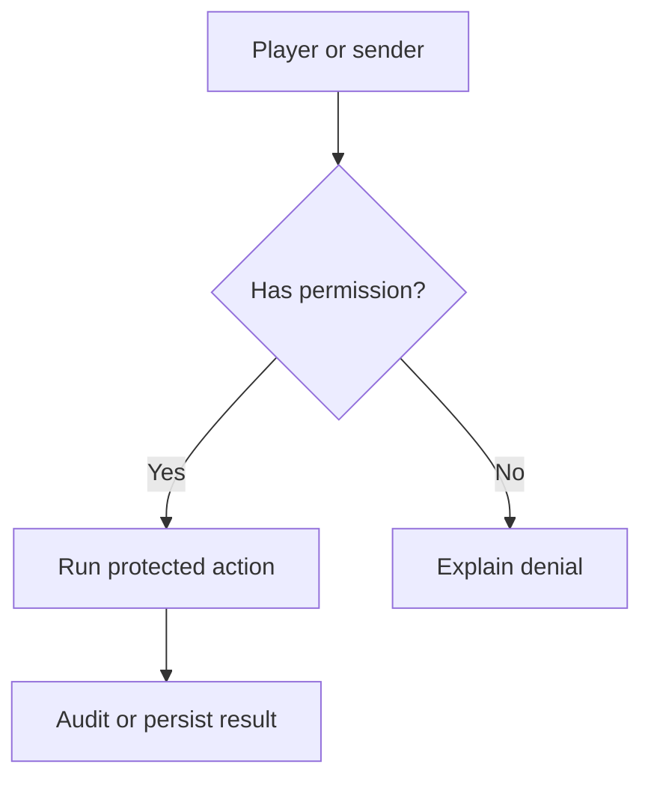

Bukkit's permission system gives you fine-grained control over what players can and cannot do with your plugin. Every permission is a dot-separated string (e.g., `myplugin.command.greet`), and Bukkit lets you declare these nodes in `plugin.yml` with sensible defaults, group them into hierarchies using wildcard parents, and check or grant them programmatically at runtime. You never need to hard-code "is this player an OP?" checks — instead you check a named permission node and let the server or a permissions plugin decide who holds it.

{/* visual-map:start */}
## Visual map


{/* visual-map:end */}

## Declaring Permissions in plugin.yml

The `permissions:` block in `plugin.yml` is where you register every node your plugin uses. Bukkit reads this at load time so that server administrators and permissions plugins can discover your nodes before any player connects.

```yaml plugin.yml
name: MyPlugin
version: 1.0.0
main: com.example.myplugin.MyPlugin
api-version: 1.20

permissions:
  myplugin.*:
    description: Grants all MyPlugin permissions.
    default: op
    children:
      myplugin.greet: true
      myplugin.admin: true

  myplugin.greet:
    description: Allows the player to use /greet.
    default: true

  myplugin.admin:
    description: Allows access to admin-only features.
    default: op
```

Each permission entry supports three optional sub-keys:

| Key | Type | Purpose |
|---|---|---|
| `description` | `String` | Human-readable description shown in `/permissions` and docs |
| `default` | `String` | Who holds this permission by default (see table below) |
| `children` | `Map<String, Boolean>` | Child permissions this node grants (or revokes) |

## Checking Permissions in Code

Call `hasPermission(String)` on any `CommandSender` or `Player` to test whether the sender holds a node:

```java PermissionCheck.java
import org.bukkit.command.Command;
import org.bukkit.command.CommandExecutor;
import org.bukkit.command.CommandSender;

public class AdminCommand implements CommandExecutor {

    @Override
    public boolean onCommand(CommandSender sender, Command command, String label, String[] args) {
        if (!sender.hasPermission("myplugin.admin")) {
            sender.sendMessage("§cYou don't have permission to use this command.");
            return true;
        }

        // Permission is granted — run the admin logic
        sender.sendMessage("§aAdmin action executed.");
        return true;
    }
}
```

`hasPermission` returns `true` if:
- The sender has been explicitly granted the node by a permissions plugin, or
- The node's `PermissionDefault` evaluates to `true` for this sender and no explicit override exists

<Tip>
  Always check permissions via `hasPermission` rather than `isOp()`. Using named nodes means server admins can grant or revoke individual features without giving players full operator status.
</Tip>

## PermissionDefault Enum

The `default:` value in `plugin.yml` maps to one of the four constants in `org.bukkit.permissions.PermissionDefault`:

| Enum constant | `plugin.yml` value | Who has this permission by default |
|---|---|---|
| `PermissionDefault.TRUE` | `true` | **Every player and console**, regardless of OP status |
| `PermissionDefault.FALSE` | `false` | **Nobody** — must be explicitly granted by a permissions plugin |
| `PermissionDefault.OP` | `op` | **Operators only** (players where `isOp()` returns `true`) |
| `PermissionDefault.NOT_OP` | `!op` | **Non-operators only** (regular players, not OPs) |

If you omit the `default:` key, Bukkit uses `PermissionDefault.OP` as the fallback, meaning only operators hold the permission unless a permissions plugin grants it explicitly.

```yaml Permission default examples
permissions:
  myplugin.chat.color:
    description: Allows colored chat messages.
    default: true       # All players can use color by default

  myplugin.admin.reload:
    description: Allows /myplugin reload.
    default: op         # Only OPs by default

  myplugin.restricted:
    description: Access to a restricted feature.
    default: false      # No one by default — must be explicitly granted

  myplugin.survival.only:
    description: A perk for non-OP survival players.
    default: "!op"      # Only non-OPs hold this by default
```

## Permission Wildcards and Children

You can model a permission hierarchy by declaring a parent node whose children list maps child permission names to a boolean. When a player holds the parent, Bukkit automatically grants every child node mapped to `true` (or revokes nodes mapped to `false`).

```yaml plugin.yml (hierarchy)
permissions:
  myplugin.*:
    description: Grants every MyPlugin permission.
    default: op
    children:
      myplugin.greet: true
      myplugin.teleport: true
      myplugin.admin: true

  myplugin.moderator:
    description: Moderator bundle — everything except admin.
    default: false
    children:
      myplugin.greet: true
      myplugin.teleport: true
      myplugin.admin: false   # Explicitly deny admin even if granted elsewhere
```

A player granted `myplugin.*` automatically has `myplugin.greet`, `myplugin.teleport`, and `myplugin.admin`. A player granted `myplugin.moderator` has the first two but is actively denied `myplugin.admin`.

<Note>
  Bukkit's built-in permission system only evaluates wildcard parents when the `children` map is explicitly defined. If you want `myplugin.*` to auto-expand, you must list every child node under it in `plugin.yml` or register them programmatically.
</Note>

## Programmatic Permissions

Sometimes you need to create or register permission nodes at runtime rather than in `plugin.yml` — for example, when node names are generated from config data. Use the `org.bukkit.permissions.Permission` class and register it via `PluginManager.addPermission`.

### Creating a Permission object

`Permission` has several constructors. The most complete one is:

```java
Permission(String name, String description, PermissionDefault defaultValue, Map<String, Boolean> children)
```

All parameters after `name` are optional (pass `null` to use defaults).

### Registering in onEnable

```java MyPlugin.java
package com.example.myplugin;

import java.util.HashMap;
import java.util.Map;
import org.bukkit.permissions.Permission;
import org.bukkit.permissions.PermissionDefault;
import org.bukkit.plugin.java.JavaPlugin;

public final class MyPlugin extends JavaPlugin {

    @Override
    public void onEnable() {
        registerPermissions();
    }

    private void registerPermissions() {
        // Create individual leaf permissions
        Permission greetPerm = new Permission(
            "myplugin.greet",
            "Allows the player to use /greet.",
            PermissionDefault.TRUE
        );

        Permission adminPerm = new Permission(
            "myplugin.admin",
            "Allows access to admin-only features.",
            PermissionDefault.OP
        );

        // Create a wildcard parent that bundles all children
        Map<String, Boolean> children = new HashMap<>();
        children.put("myplugin.greet", true);
        children.put("myplugin.admin", true);

        Permission wildcardPerm = new Permission(
            "myplugin.*",
            "Grants all MyPlugin permissions.",
            PermissionDefault.OP,
            children
        );

        // Register with the PluginManager so other plugins and the server can see them
        getServer().getPluginManager().addPermission(greetPerm);
        getServer().getPluginManager().addPermission(adminPerm);
        getServer().getPluginManager().addPermission(wildcardPerm);
    }
}
```

### Checking a programmatic permission at runtime

After registration, `hasPermission` works exactly the same way as for `plugin.yml`-declared nodes:

```java RuntimePermissionCheck.java
if (player.hasPermission("myplugin.greet")) {
    player.sendMessage("§aYou can use /greet!");
}
```

<Warning>
  Permissions registered via `addPermission` exist only for the current server session. They are not persisted to disk and will be re-registered each time your plugin enables. If you modify a permission's children map directly (via `Permission.getChildren()`), call `Permission.recalculatePermissibles()` afterward so all online players' effective permissions are updated immediately. Note that `Permission.setDefault()` calls `recalculatePermissibles()` internally — you do not need to call it manually after `setDefault()`.
</Warning>

## Putting It All Together

Here is a complete, realistic example combining `plugin.yml` declarations, a permission check inside `onCommand`, and a programmatic permission registered in `onEnable`:

```yaml plugin.yml
permissions:
  myplugin.greet:
    description: Allows the player to use /greet.
    default: true

  myplugin.admin:
    description: Allows admin-only commands.
    default: op

  myplugin.*:
    description: Grants all MyPlugin permissions.
    default: op
    children:
      myplugin.greet: true
      myplugin.admin: true
```

```java MyPlugin.java
@Override
public void onEnable() {
    // Register a runtime-only permission for a feature loaded from config
    String featureName = getConfig().getString("special-feature", "vip-lounge");
    Permission runtimePerm = new Permission(
        "myplugin.feature." + featureName,
        "Access to the " + featureName + " feature.",
        PermissionDefault.FALSE
    );
    getServer().getPluginManager().addPermission(runtimePerm);

    getCommand("greet").setExecutor(new GreetCommand());
}
```

```java GreetCommand.java (permission check in onCommand)
@Override
public boolean onCommand(CommandSender sender, Command command, String label, String[] args) {
    // Check the named permission node — not isOp()
    if (!sender.hasPermission("myplugin.greet")) {
        sender.sendMessage("§cYou don't have permission to greet players.");
        return true;
    }

    if (args.length != 1) {
        return false;
    }

    Player target = Bukkit.getPlayerExact(args[0]);
    if (target == null) {
        sender.sendMessage("§cPlayer not found.");
        return true;
    }

    target.sendMessage("§e" + sender.getName() + " greets you!");
    return true;
}
```
