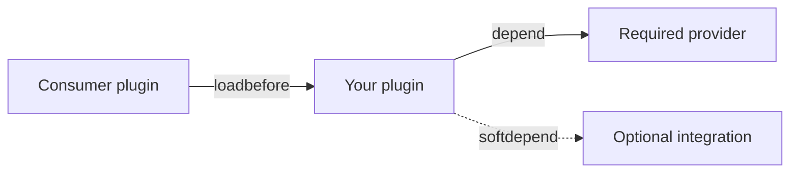

# Plugin dependencies

Dependency metadata influences load order and availability. It does not prove that the installed plugin exposes the version or capability your code expects.

## Metadata semantics

- `depend` makes the dependency mandatory and loads this plugin after it.
- `softdepend` loads after an optional plugin when present.
- `loadbefore` requests that this plugin load before named plugins.
- Choose one relationship based on actual runtime requirements, not to silence ordering bugs.

## Runtime integration

- Check `PluginManager#getPlugin` and `Plugin#isEnabled` for optional integrations.
- Prefer a published service or API interface over reflection into implementation classes.
- Delay integration registration until both sides are enabled.
- Disable only the affected integration when an optional dependency is missing.

## Classloading

- Compile-time access to an absent optional API can still trigger classloading failure.
- Keep optional integration classes behind a capability check and avoid loading them from always-used signatures.
- Do not bundle another plugin's API implementation.
- Test with the dependency present, absent, disabled, and at unsupported versions.

## Dependency relationships



## Example

```java
Plugin vault = getServer().getPluginManager().getPlugin("Vault");
if (vault != null && vault.isEnabled()) {
    integrations.enableVault();
} else {
    getLogger().info("Vault not found; economy integration disabled");
}
```

## Production check

- Validate inputs and capabilities before mutation.
- Keep hot-path work bounded and observable.
- Re-check live state after any delay or asynchronous boundary.
- Clean up every resource owned by the feature during disable.