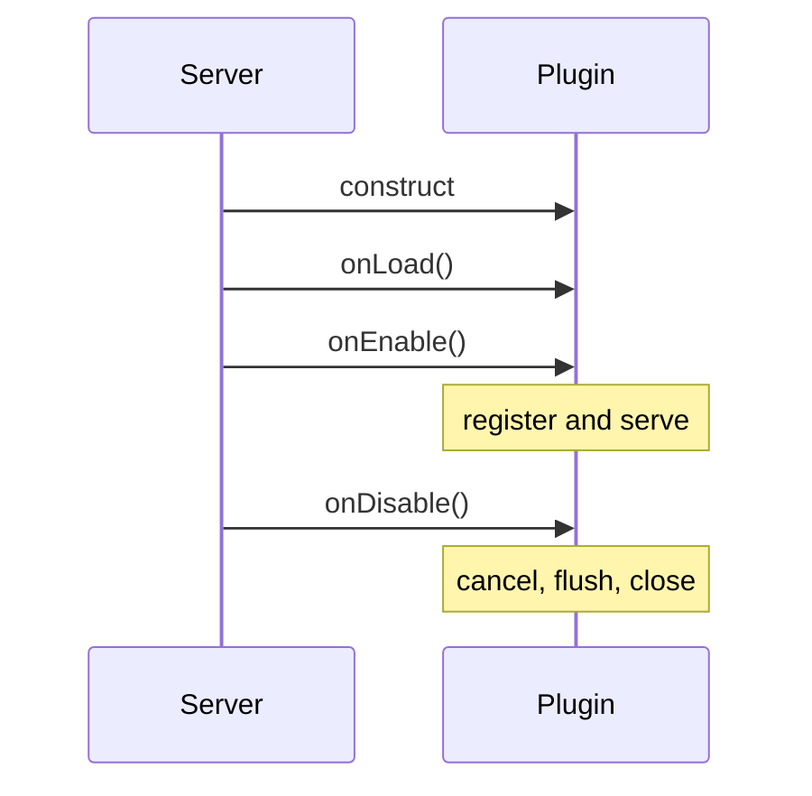

# Plugin lifecycle

Bukkit constructs your `JavaPlugin`, then moves it through load, enable, and disable phases. Keep constructors empty; the server has not finished wiring the plugin when Java construction runs.

## Lifecycle hooks

- `onLoad()` is for rare pre-enable setup that does not depend on enabled plugins or worlds being ready.
- `onEnable()` validates required inputs, creates services, and registers commands, listeners, and tasks.
- `onDisable()` stops new work, cancels tasks, flushes or closes storage, unregisters services, and clears sessions.
- If `onEnable()` cannot establish a required invariant, log the reason and disable the plugin.

## Own what you create

- Keep handles to tasks, executors, database pools, services, bosses, menus, and other resources.
- Make shutdown idempotent so partial startup can still be cleaned up.
- Do not rely on finalizers or JVM exit for persistence.
- Avoid plugin reloaders that bypass a real classloader and server restart.

## Lifecycle order



## Example

```java
public final class ExamplePlugin extends JavaPlugin {
    private FeatureRuntime runtime;

    @Override
    public void onEnable() {
        runtime = FeatureRuntime.start(this);
    }

    @Override
    public void onDisable() {
        if (runtime != null) runtime.close();
    }
}
```

## Production check

- Validate inputs and capabilities before mutation.
- Keep hot-path work bounded and observable.
- Re-check live state after any delay or asynchronous boundary.
- Clean up every resource owned by the feature during disable.