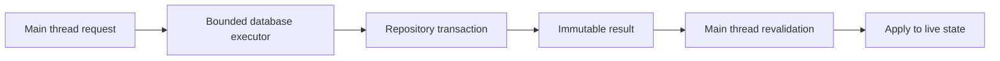

# Databases

Database calls can block for milliseconds or seconds and must not run on the server thread. Hide SQL behind repositories, use bounded executors/pools, and return immutable domain data to a main-thread continuation.

## Connection strategy

- SQLite suits one server and one process; configure it for the plugin's concurrency pattern.
- Use a small connection pool for remote SQL databases.
- Set connection, statement, and socket timeouts.
- Close `Connection`, `PreparedStatement`, and `ResultSet` with try-with-resources.

## Schema and queries

- Run ordered, idempotent migrations before accepting feature traffic.
- Use prepared statements for every user-controlled value.
- Add indexes for actual lookup and uniqueness rules.
- Use transactions for multi-step state changes such as balance plus audit record.

## Async boundary

- Capture UUIDs and immutable request data on the main thread.
- Execute repository work on a bounded executor.
- Schedule a main-thread continuation, re-resolve the player/session, and discard stale results.
- Drain or reject new work and close the pool during disable.

## Thread boundary



## Example

```java
CompletableFuture.supplyAsync(() -> repository.load(playerId), databaseExecutor)
    .thenAccept(profile -> Bukkit.getScheduler().runTask(plugin, () -> {
        Player player = Bukkit.getPlayer(playerId);
        if (player == null || !sessions.isCurrent(playerId, requestId)) return;
        sessions.open(player, profile);
    }))
    .exceptionally(error -> {
        plugin.getLogger().log(Level.SEVERE, "Profile load failed for " + playerId, error);
        return null;
    });
```

## Failure checklist

- Define timeouts, limits, and ownership at the boundary.
- Validate decoded values before they reach gameplay logic.
- Make retries and duplicate delivery idempotent where necessary.
- Close clients, pools, executors, and registrations during disable.