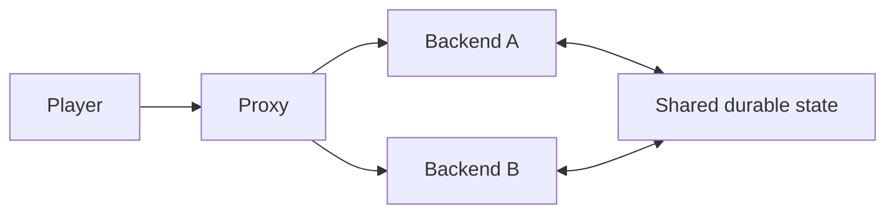

# Proxy networks

A proxy routes client connections between backend servers. Backend plugins should not assume that local player presence, IP data, permissions, or memory state represents the whole network.

## Identity and trust

- Use UUIDs as the shared identity key.
- Configure proxy forwarding and backend security exactly as the proxy platform documents.
- Do not trust forwarding headers or plugin messages from an exposed backend.
- Keep backend ports private from direct public connections.

## Transfers

- Request a transfer through the supported proxy channel/API.
- Expect the source player to disconnect and a new backend session to join.
- Persist or publish required handoff state before initiating transfer.
- Use a correlation/request ID and expiry for pending transfers.

## Shared state

- Use a shared database, cache, or broker for durable network-wide state.
- Define ownership and conflict rules for concurrent servers.
- Never perform distributed I/O on the server thread.
- Design for a server disappearing without a graceful quit or acknowledgement.

## Network topology



## Example

```java
public void transfer(Player player, String targetServer) {
    UUID requestId = UUID.randomUUID();
    handoffs.save(new Handoff(requestId, player.getUniqueId(), targetServer, expiresAt));
    proxyMessenger.connect(player, targetServer, requestId);
}
```

## Failure checklist

- Define timeouts, limits, and ownership at the boundary.
- Validate decoded values before they reach gameplay logic.
- Make retries and duplicate delivery idempotent where necessary.
- Close clients, pools, executors, and registrations during disable.