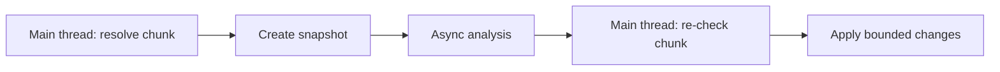

# Chunks and snapshots

Chunks are the unit of world loading. Accessing a block can load or generate its chunk, so spatial features must decide when loading is allowed and who keeps the chunk resident.

## Loading policy

- Check `isChunkLoaded` before work that must not cause loads.
- Use explicit loading only for bounded, intentional operations.
- Plugin chunk tickets keep chunks loaded; remove every ticket during cleanup.
- Never scan an unbounded radius of chunks from a command or event.

## Snapshots

- A `ChunkSnapshot` provides read-oriented copied data suitable for analysis away from live world mutation.
- Acquire the snapshot on the main thread, then process only the snapshot asynchronously.
- Snapshots become stale as the world changes.
- Return compact results and re-check the live chunk before applying mutations.

## Generation and unload

- Differentiate loading an existing chunk from generating a new one.
- Listen for load/unload events only when lifecycle tracking is actually needed.
- Do not retain entities, blocks, or chunk objects after unload.
- Partition large work into predictable per-tick budgets.

## Snapshot workflow



## Example

```java
Chunk chunk = world.getChunkAt(chunkX, chunkZ);
ChunkSnapshot snapshot = chunk.getChunkSnapshot();
CompletableFuture.supplyAsync(() -> analyze(snapshot), executor)
    .thenAccept(result -> Bukkit.getScheduler().runTask(plugin, () -> {
        if (!world.isChunkLoaded(chunkX, chunkZ)) return;
        apply(result);
    }));
```

## Production checklist

- Validate identity, world, and feature ownership at the point of mutation.
- Keep main-thread work bounded; move only isolated data work off-thread.
- Handle disconnect, unload, reload, and disable explicitly.
- Read the exact API contract for the server version you target.