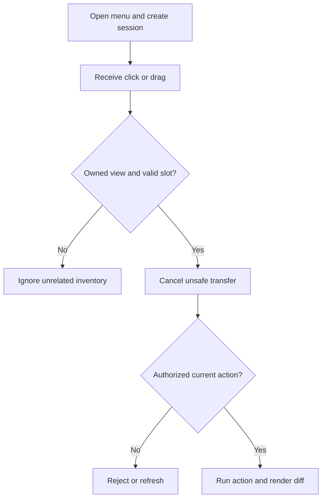

# GUI menus

A chest-style menu is an ordinary inventory view with plugin-defined meaning. The client can still attempt shift-clicks, number keys, drags, swaps, double-clicks, and rapid repeated input, so protect the whole interaction surface.

## Identify ownership

- Implement a custom `InventoryHolder` or keep a session keyed by the inventory identity.
- Do not identify a menu only by its title; titles are presentation and can collide.
- Map slots to immutable button actions.
- Keep per-view state separate when content or authorization differs by player.

## Handle clicks and drags

- Check the active top inventory/holder and cancel interactions the menu does not allow.
- Use raw slots to distinguish top inventory from the player's inventory.
- Handle `InventoryDragEvent` when dragged slots can cross into the menu.
- Validate click type, button permission, cooldown, and session state before running the action.

## Render and close

- Build the initial inventory on the main thread.
- Update only slots whose visible content changed.
- Close or replace views safely after click handling when needed.
- Remove sessions on close, quit, kick, world change if relevant, and plugin disable.

## Interaction flow



## Example

```java
@EventHandler
public void onClick(InventoryClickEvent event) {
    if (!(event.getView().getTopInventory().getHolder() instanceof KitsMenu menu)) return;
    event.setCancelled(true);
    if (event.getRawSlot() < 0 || event.getRawSlot() >= event.getView().getTopInventory().getSize()) return;
    menu.click((Player) event.getWhoClicked(), event.getRawSlot(), event.getClick());
}
```

## Production checklist

- Validate the current object type, ownership, and lifecycle before mutation.
- Bound hot-path loops and spatial work.
- Respect cancellation and changes made by other plugins.
- Remove plugin-owned runtime state during feature shutdown.