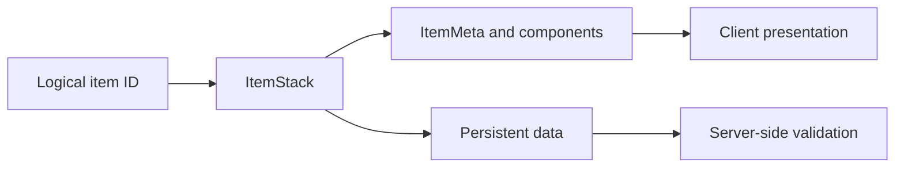

# Inventories and ItemStack

Create items, move stacks, manage equipment, and handle leftovers.

{/* visual-map:start */}
<Frame caption="A practical inventory view with plugin-owned buttons and pagination controls.">
  
</Frame>

## Visual map


{/* visual-map:end */}

## Mental model

Bukkit exposes server-owned objects through public interfaces. Obtain them from the server, an event, a factory, or another API object. Do not construct implementation classes or retain live objects longer than their lifecycle.

## Core workflow

1. Validate configuration and player-controlled input.
2. Resolve the current Bukkit objects needed for the action.
3. Check permissions and cancellation state.
4. Perform live server mutations on the main thread.
5. Move only isolated blocking I/O or CPU work off-thread.
6. Re-check player, world, entity, or plugin state before applying delayed results.
7. Clean up every owned resource during feature shutdown.

```java
ItemStack item = new ItemStack(Material.DIAMOND_SWORD);
ItemMeta meta = item.getItemMeta();
meta.setDisplayName("§bFrostbite");
meta.getPersistentDataContainer().set(
    new NamespacedKey(plugin, "custom_item"),
    PersistentDataType.STRING,
    "frostbite"
);
item.setItemMeta(meta);
```

## Edge cases

- The player disconnects, dies, changes worlds, or loses permission.
- A world or chunk unloads during delayed work.
- Another plugin cancels or changes the same event.
- Configuration reloads while sessions are active.
- The plugin disables with tasks, writes, or menus still open.
- A duplicate click, command, packet, or reward is delivered.

## Performance

Keep hot event handlers short. Bound loops and spatial searches, cache only stable values, batch large world edits across ticks, avoid blocking I/O, and update UI only when visible data changes.

## Production checklist

- Use UUIDs for player identity.
- Use `NamespacedKey` for plugin-owned registrations and data.
- Validate nullability and object validity.
- Document thread ownership.
- Cancel tasks and release registrations.
- Test clean startup, shutdown, restart, and failure recovery.
- Read exact overloads and deprecations in the official Javadocs.

<Warning>
Most live Bukkit API state is not thread-safe. Unless the exact API contract says otherwise, access worlds, entities, players, inventories, and plugin state on the main server thread.
</Warning>
