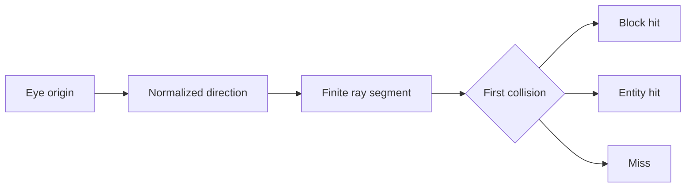

# Vectors and ray tracing

Vectors express direction and displacement; ray traces test a finite segment against blocks or entities. Always choose an origin, normalized direction, maximum distance, collision policy, and filter.

## Vector basics

- Clone mutable `Location` and `Vector` values before changing them.
- Normalize direction when distance should be measured in blocks.
- Use dot products for facing/alignment and squared distance for comparisons that do not need a square root.
- Never normalize a zero-length vector.

## Ray trace policy

- Choose block-only, entity-only, or combined world ray tracing.
- Set fluid collision and passable-block behavior intentionally.
- Filter out the shooter and unrelated or invulnerable entities.
- Keep maximum distance and entity ray size bounded.

## Results

- A miss returns `null`.
- A hit may contain a block, entity, exact hit position, and block face depending on the method.
- Re-check permission and target validity before mutating.
- Do not use broad nearby-entity scans when one ray trace represents the mechanic.

## Ray result flow



## Example

```java
Location eye = player.getEyeLocation();
Vector direction = eye.getDirection().normalize();
RayTraceResult hit = player.getWorld().rayTrace(
    eye, direction, 6.0, FluidCollisionMode.NEVER, true, 0.2,
    entity -> entity != player && entity.isValid()
);
if (hit != null && hit.getHitEntity() != null) handleTarget(hit.getHitEntity());
```

## Production checklist

- Validate the current object type, ownership, and lifecycle before mutation.
- Bound hot-path loops and spatial work.
- Respect cancellation and changes made by other plugins.
- Remove plugin-owned runtime state during feature shutdown.