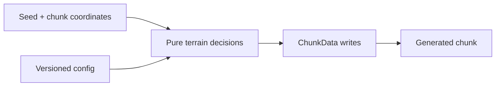

# World generation

Custom generation is invoked while chunks are being created and may run frequently or concurrently depending on the server. Generation must be deterministic for a seed and chunk coordinate, bounded, and independent of live world mutation.

## Register a generator

- Return a `ChunkGenerator` from the plugin entry point or configure its ID through world creation.
- Use the supplied world info, random source, chunk coordinates, and chunk data.
- Write only within the provided chunk data during generation.
- Do not call ordinary live-world block APIs from generator callbacks.

## Determinism

- Derive randomness from the supplied seed/context, not wall-clock time.
- The same seed and plugin version should produce the same terrain.
- Version persistent generator behavior before changing algorithms on existing worlds.
- Keep cross-chunk structures coordinated through deterministic region math.

## Performance and safety

- Avoid blocking I/O, network calls, and server-global scans.
- Cache only immutable generator configuration or bounded pure computations.
- Respect min/max height and biome/provider contracts.
- Test chunk borders, negative coordinates, restart generation, and upgrades.

## Generation boundary



## Example

```java
@Override
public ChunkData generateChunkData(World world, Random random, int chunkX, int chunkZ, BiomeGrid biome) {
    ChunkData data = createChunkData(world);
    int floor = world.getMinHeight() + 64;
    for (int x = 0; x < 16; x++) {
        for (int z = 0; z < 16; z++) data.setBlock(x, floor, z, Material.STONE);
    }
    return data;
}
```

## Production checklist

- Validate the current object type, ownership, and lifecycle before mutation.
- Bound hot-path loops and spatial work.
- Respect cancellation and changes made by other plugins.
- Remove plugin-owned runtime state during feature shutdown.