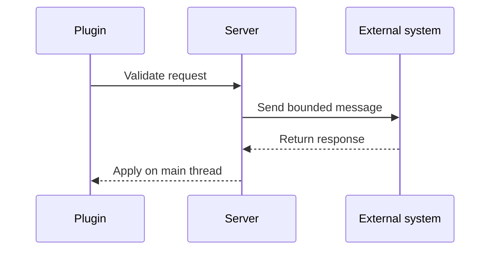

Plugin messaging channels are a low-level byte-pipe that Minecraft uses to pass custom data between a server plugin and either the connected proxy (BungeeCord or Velocity) or a client-side mod. Each message is identified by a **channel name** and carries a raw byte array payload. Your plugin registers which channels it wants to send on (outgoing) or listen on (incoming), and the Bukkit `Messenger` handles routing. Channel names must follow the `namespace:name` format and consist only of `[a-z0-9/._-]` — the legacy `"BungeeCord"` channel is the notable exception to this rule.

{/* visual-map:start */}
## Visual map


{/* visual-map:end */}

## Registering a channel

Before you can send or receive messages you must declare your intent to the `Messenger`. Do this in `onEnable()`.

```java title="MyPlugin.java"
@Override
public void onEnable() {
    // Register an outgoing channel so this plugin can send messages on it
    getServer().getMessenger().registerOutgoingPluginChannel(this, "BungeeCord");

    // Register an incoming channel and attach a listener to receive messages
    getServer().getMessenger().registerIncomingPluginChannel(
        this,
        "BungeeCord",
        new MyPluginMessageListener(this)
    );
}
```

You can register the same plugin as both sender and receiver on the same channel. If you only need to send, register outgoing only; if you only need to receive, register incoming only.

## Sending a message

Build your payload with `ByteArrayDataOutput` (from Guava's `com.google.common.io.ByteStreams`), then deliver it by calling `sendPluginMessage` on a `Player`. The player acts as the conduit — the message travels through their connection to the proxy.

```java title="SendPluginMessage.java"
import com.google.common.io.ByteArrayDataOutput;
import com.google.common.io.ByteStreams;

public void connectToServer(Player player, String serverName) {
    ByteArrayDataOutput out = ByteStreams.newDataOutput();
    out.writeUTF("Connect");      // BungeeCord subchannel
    out.writeUTF(serverName);     // target server name

    player.sendPluginMessage(this, "BungeeCord", out.toByteArray());
}
```

<Warning>
  Plugin messaging requires **at least one online player** to route a message to the proxy. You cannot send proxy-targeted plugin messages when the server is empty. If you need to communicate without a player present, consider an alternative channel such as a shared database, Redis, or a direct TCP socket.
</Warning>

## Receiving a message

Implement the `PluginMessageListener` interface and override `onPluginMessageReceived(String channel, Player player, byte[] message)`. Read the payload with `ByteArrayDataInput`.

```java title="MyPluginMessageListener.java"
import com.google.common.io.ByteArrayDataInput;
import com.google.common.io.ByteStreams;
import org.bukkit.entity.Player;
import org.bukkit.plugin.messaging.PluginMessageListener;

public class MyPluginMessageListener implements PluginMessageListener {
    private final MyPlugin plugin;

    public MyPluginMessageListener(MyPlugin plugin) {
        this.plugin = plugin;
    }

    @Override
    public void onPluginMessageReceived(String channel, Player player, byte[] message) {
        if (!channel.equals("BungeeCord")) return;

        ByteArrayDataInput in = ByteStreams.newDataInput(message);
        String subchannel = in.readUTF();

        if (subchannel.equals("GetServer")) {
            String serverName = in.readUTF();
            plugin.getLogger().info("This server's name is: " + serverName);
        }
    }
}
```

The `player` parameter identifies which player's connection delivered the message — it is the proxy's chosen carrier, not necessarily the target of the action.

## BungeeCord channel operations

The `BungeeCord` channel has a set of well-known subchannels. You write the subchannel name as the first UTF string in the payload, followed by subchannel-specific arguments.

| Subchannel | Direction | Description |
|---|---|---|
| `Connect` | Send | Connect a player to the named server |
| `ConnectOther` | Send | Connect a named player on any server to another server |
| `IP` | Send / Receive | Request the real IP and port of a player |
| `PlayerCount` | Send / Receive | Request the player count on a server or `ALL` |
| `PlayerList` | Send / Receive | Request the list of player names on a server |
| `GetServer` | Send / Receive | Request the name of the current server |
| `GetServerInfo` | Send / Receive | Request info (name, motd, players) for a server |
| `Forward` | Send | Forward a custom plugin message to another server |
| `ForwardToPlayer` | Send | Forward a custom plugin message to a specific player's server |
| `UUID` | Send / Receive | Request the UUID of a player |

For subchannels that return data (like `GetServer`), send the request from a plugin message, then read the response in your `PluginMessageListener` — BungeeCord sends the reply back on the same `BungeeCord` channel.

### Full example: connect a player to another server

```java title="ServerConnector.java"
import com.google.common.io.ByteArrayDataOutput;
import com.google.common.io.ByteStreams;
import org.bukkit.entity.Player;
import org.bukkit.plugin.java.JavaPlugin;

public class ServerConnector {
    private final JavaPlugin plugin;

    public ServerConnector(JavaPlugin plugin) {
        this.plugin = plugin;
    }

    /**
     * Sends a player to the specified BungeeCord server.
     *
     * @param player     the player to transfer
     * @param serverName the BungeeCord server name defined in config.yml
     */
    public void sendToServer(Player player, String serverName) {
        ByteArrayDataOutput out = ByteStreams.newDataOutput();
        out.writeUTF("Connect");
        out.writeUTF(serverName);

        player.sendPluginMessage(plugin, "BungeeCord", out.toByteArray());
        player.sendMessage("Sending you to " + serverName + "...");
    }
}
```

Register the channel in `onEnable()` and call `sendToServer(player, "lobby")` wherever you need it.

## Unregistering channels

Clean up your registrations in `onDisable()` to avoid stale listeners if your plugin is reloaded.

```java title="MyPlugin.java"
@Override
public void onDisable() {
    // Unregister all outgoing channels this plugin registered
    getServer().getMessenger().unregisterOutgoingPluginChannel(this);

    // Unregister all incoming channels this plugin registered
    getServer().getMessenger().unregisterIncomingPluginChannel(this);
}
```

You can also unregister a single channel by passing its name, or remove one specific listener with the three-argument overload that takes the `PluginMessageListener` instance.

<Note>
  Channel names for custom (non-BungeeCord) channels must use the `namespace:name` format, for example `"myplugin:data"`. Bukkit enforces this format and throws `IllegalArgumentException` if you pass a bare name.
</Note>
