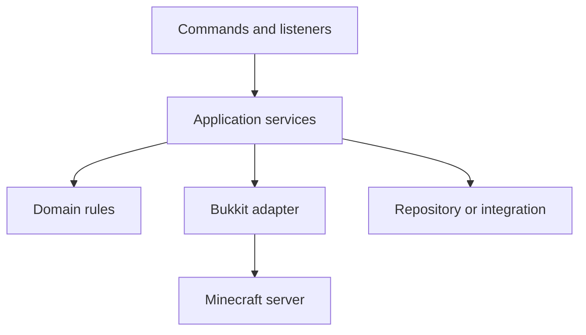

The Bukkit Services Manager lets your plugin expose a Java interface as a runtime-discoverable service, and lets other plugins look that service up without knowing which plugin provides it. Rather than hard-coding `Plugin.getPlugin(EconomyPlugin.class)` and creating a tight compile-time coupling, the consumer simply asks the server for "whoever is providing `EconomyService`" and receives the highest-priority registered implementation. This is the same mechanism that Vault uses to decouple economy, permission, and chat plugins from their consumers.

{/* visual-map:start */}
## Visual map


{/* visual-map:end */}

## Registering a service

Call `getServer().getServicesManager().register(Class, implementation, plugin, priority)` in your provider plugin's `onEnable()`. The first argument is the **interface class** (the contract), the second is your **implementing object**, the third is your plugin instance (used for cleanup tracking), and the fourth is a `ServicePriority`.

```java title="EconomyPlugin.java (provider)"
// Define the service interface (usually in a shared API JAR or your plugin)
// public interface EconomyService { void deposit(Player p, double amount); ... }

@Override
public void onEnable() {
    EconomyService economy = new MyEconomyImplementation(this);

    getServer().getServicesManager().register(
        EconomyService.class,  // the interface
        economy,               // your implementation
        this,                  // your plugin
        ServicePriority.Normal // priority
    );

    getLogger().info("EconomyService registered.");
}
```

## Looking up a service

Consumer plugins call `getRegistration(Class)` to get a `RegisteredServiceProvider<T>`, then call `.getProvider()` on it to get the actual implementation. Always null-check the registration — `getRegistration` returns `null` when no provider has been registered.

```java title="ShopPlugin.java (consumer)"
@Override
public void onEnable() {
    RegisteredServiceProvider<EconomyService> registration =
        getServer().getServicesManager().getRegistration(EconomyService.class);

    if (registration == null) {
        getLogger().warning("No EconomyService found — shop features disabled.");
        return;
    }

    EconomyService economy = registration.getProvider();
    getLogger().info("Using economy provider: "
        + economy.getClass().getSimpleName());
}
```

You can also use the convenience method `load(Class)` to skip the registration wrapper and get the provider directly. It returns `null` when nothing is registered:

```java title="QuickLookup.java"
EconomyService economy = getServer().getServicesManager().load(EconomyService.class);
if (economy != null) {
    economy.deposit(player, 100.0);
}
```

## ServicePriority

When multiple plugins register the same service interface, the Services Manager always returns the one with the **highest** priority. Use `ServicePriority` to indicate how authoritative your implementation is.

| Priority | Use case |
|---|---|
| `Lowest` | Fallback or stub implementation, should almost always be overridden |
| `Low` | Non-preferred implementation that works but isn't the primary choice |
| `Normal` | Standard implementation — use this for most plugins |
| `High` | Preferred implementation that should override `Normal` providers |
| `Highest` | Authoritative implementation that must take precedence |

```java title="ServicePriority enum values"
ServicePriority.Lowest
ServicePriority.Low
ServicePriority.Normal
ServicePriority.High
ServicePriority.Highest
```

If two plugins register at the same priority level, the last one to register wins — but relying on load order is fragile. Pick an appropriate priority instead.

## Soft-dependency pattern

A "soft dependency" means your plugin can function without the service but gains extra features when it is present. Check for the service during `onEnable()` and gracefully skip the feature if it is absent.

```java title="MyPlugin.java (soft dependency)"
private EconomyService economy = null;

@Override
public void onEnable() {
    // Attempt to grab the economy service, but don't fail if it's missing
    RegisteredServiceProvider<EconomyService> reg =
        getServer().getServicesManager().getRegistration(EconomyService.class);

    if (reg != null) {
        economy = reg.getProvider();
        getLogger().info("Economy integration enabled.");
    } else {
        getLogger().info("No economy plugin found — paid features disabled.");
    }
}

public boolean chargePlayer(Player player, double amount) {
    if (economy == null) {
        // Feature not available — fail gracefully
        return false;
    }
    return economy.withdraw(player, amount);
}
```

Declare the provider plugin as `softdepend` (not `depend`) in your `plugin.yml` so your plugin still loads even when the economy plugin is absent:

```yaml title="plugin.yml"
name: MyPlugin
version: 1.0.0
main: com.example.myplugin.MyPlugin
softdepend:
  - Vault
```

## Complete example

Here is a full end-to-end example: an interface definition, a provider plugin that registers it, and a consumer plugin that looks it up.

<CodeGroup>

```java title="EconomyService.java (interface)"
package com.example.economy.api;

import org.bukkit.entity.Player;

public interface EconomyService {

    /** Returns the current balance of the given player. */
    double getBalance(Player player);

    /** Deposits the given amount into the player's account. */
    void deposit(Player player, double amount);

    /** Withdraws the given amount from the player's account.
     *  Returns false if the player has insufficient funds. */
    boolean withdraw(Player player, double amount);
}
```

```java title="EconomyPlugin.java (provider)"
package com.example.economy;

import com.example.economy.api.EconomyService;
import org.bukkit.plugin.ServicePriority;
import org.bukkit.plugin.java.JavaPlugin;

public class EconomyPlugin extends JavaPlugin {

    @Override
    public void onEnable() {
        EconomyService service = new SimpleEconomyService(this);

        getServer().getServicesManager().register(
            EconomyService.class,
            service,
            this,
            ServicePriority.Normal
        );

        getLogger().info("EconomyService registered at Normal priority.");
    }

    @Override
    public void onDisable() {
        // ServicesManager.unregisterAll is called automatically by Bukkit
        // when your plugin disables, but you can do it explicitly if needed:
        getServer().getServicesManager().unregisterAll(this);
    }
}
```

```java title="ShopPlugin.java (consumer)"
package com.example.shop;

import com.example.economy.api.EconomyService;
import org.bukkit.entity.Player;
import org.bukkit.plugin.RegisteredServiceProvider;
import org.bukkit.plugin.java.JavaPlugin;

public class ShopPlugin extends JavaPlugin {
    private EconomyService economy;

    @Override
    public void onEnable() {
        if (!setupEconomy()) {
            getLogger().severe("EconomyService not found — disabling ShopPlugin.");
            getServer().getPluginManager().disablePlugin(this);
            return;
        }
    }

    private boolean setupEconomy() {
        RegisteredServiceProvider<EconomyService> reg =
            getServer().getServicesManager().getRegistration(EconomyService.class);

        if (reg == null) return false;

        economy = reg.getProvider();
        return economy != null;
    }

    public boolean purchaseItem(Player player, double price, String itemName) {
        if (!economy.withdraw(player, price)) {
            player.sendMessage("Insufficient funds to buy " + itemName + ".");
            return false;
        }
        player.sendMessage("You purchased " + itemName + " for $" + price + ".");
        return true;
    }
}
```

</CodeGroup>

## Unregistering a service

Bukkit automatically calls `unregisterAll(plugin)` when your plugin is disabled, so in most cases you do not need to unregister manually. If you want to withdraw your service mid-lifecycle — for example, when a feature is toggled off at runtime — call one of the unregister methods explicitly:

```java title="UnregisterExample.java"
// Unregister a specific interface/provider pair
getServer().getServicesManager().unregister(EconomyService.class, myImplementation);

// Unregister a specific provider object from all services it was registered under
getServer().getServicesManager().unregister(myImplementation);

// Unregister all services registered by this plugin
getServer().getServicesManager().unregisterAll(this);
```

<Tip>
  This is exactly how **Vault** works. Vault defines economy, permission, and chat service interfaces; provider plugins (EssentialsX, LuckPerms, etc.) register implementations at `Normal` or `High` priority; and consumer plugins look up Vault's interfaces without ever importing the provider's classes. Model your own cross-plugin APIs the same way to keep your codebase cleanly decoupled.
</Tip>
