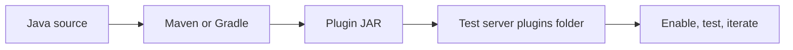

Bukkit is the Java API that lets you extend and customize a Minecraft server — adding new commands, reacting to game events, manipulating the world, and building entirely new gameplay systems. You write a plugin as a standard Java library, drop it into your server's `plugins/` folder, and the server loads it automatically at startup. Bukkit gives you the stable, documented surface you code against; the underlying server implementation handles the rest.

{/* visual-map:start */}
## Visual map

{/* visual-map:end */}

## How Bukkit fits in

The Bukkit name covers several related but distinct layers that are easy to confuse when you're getting started:

| Layer | Role |
|---|---|
| **Bukkit API** | The pure Java interface and class library you compile against. It defines events, commands, worlds, players, and every other abstraction your plugin uses. |
| **CraftBukkit** | The concrete server implementation that ships the Bukkit API classes at runtime. Your plugin never imports CraftBukkit directly — you always program to the Bukkit API. |
| **SpigotMC** | A performance-focused fork of CraftBukkit that is the most widely deployed Bukkit-compatible server. It fully implements the Bukkit API and adds its own extensions. |

When you add the Bukkit artifact as a `provided` dependency in Maven or Gradle, you compile against the API only. At runtime the SpigotMC (or CraftBukkit) server on disk supplies the real implementation. This separation means your plugin binary stays small and remains compatible across server versions as long as the API contract holds.

## What you can do with Bukkit

Bukkit exposes every major dimension of a running Minecraft server. The cards below link to the key concept and guide pages:

<CardGroup cols={3}>
  <Card title="Events" icon="bolt" href="/concepts/events">
    Listen for and react to anything that happens on the server — player logins, block breaks, entity deaths, and hundreds of other triggers.
  </Card>
  <Card title="Commands" icon="terminal" href="/concepts/commands">
    Register custom slash-commands with tab completion, permission checks, and usage messages.
  </Card>
  <Card title="Worlds & Blocks" icon="cube" href="/guides/worlds-blocks">
    Read and modify the block grid, generate custom structures, and work with multiple worlds.
  </Card>
  <Card title="Players" icon="user" href="/guides/players">
    Inspect and control player state — inventory, health, location, permissions, and chat.
  </Card>
  <Card title="Scheduler" icon="clock" href="/guides/scheduler">
    Run code on a delay or a repeating timer, either on the main thread or asynchronously.
  </Card>
  <Card title="Configuration" icon="sliders" href="/guides/configuration">
    Read and write YAML config files so server administrators can customize your plugin without touching code.
  </Card>
</CardGroup>

## Prerequisites

Before you write your first plugin, make sure you have the following in place:

- **Java 17** — The Bukkit API targets Java 17. Make sure your JDK is version 17 or later (`java -version`).
- **Maven or Gradle** — Either build tool works. The quickstart uses Maven, but Gradle snippets are included too.
- **A SpigotMC-compatible server for testing** — You need a local server to load and run your plugin. A SpigotMC or PaperMC server instance works best. Never develop against a production server.

<Note>
  Ready to write your first plugin? Head over to the [Quickstart](/quickstart) to create, build, and load a working plugin in under ten minutes.
</Note>
