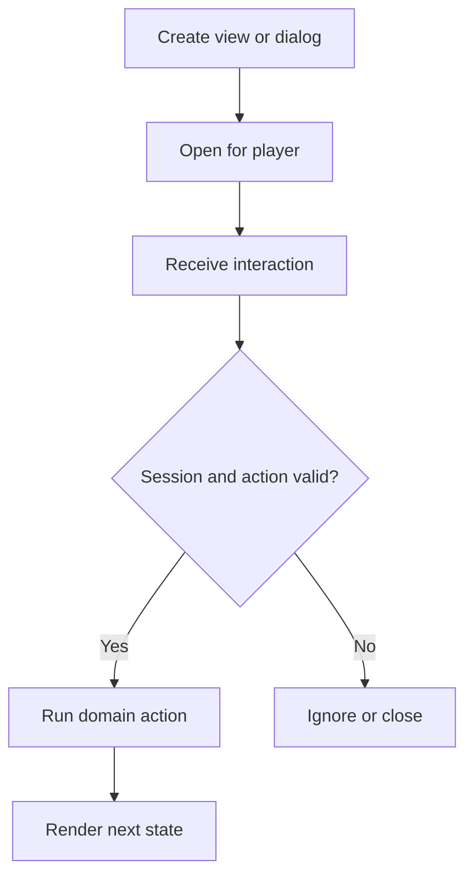

Bukkit can create excellent interfaces, but it cannot define an arbitrary new native screen on an unmodified client. The server may open screen types the vanilla protocol already understands, populate their data, react to clicks, and change client assets through a resource pack.

{/* visual-map:start */}
<Frame caption="A server-driven inventory screen on an unmodified client.">
  
</Frame>

## Visual map

{/* visual-map:end */}

## Supported screen building blocks

### Inventories and menus

Chest grids remain the most flexible click UI. Other vanilla layouts include anvil, beacon, brewing stand, crafter, crafting table, enchantment table, furnace, grindstone, hopper, lectern, loom, merchant, shulker box, smithing table, smoker, cartography table, and stonecutter.

Use `InventoryClickEvent`, `InventoryDragEvent`, `InventoryCloseEvent`, and `InventoryOpenEvent`. Check the top inventory, raw slot, click/action type, and your own holder or session marker. Cancelling every click is usually too blunt; decide which areas and actions your UI permits.

### Dialogs

Current Spigot exposes experimental `Player.showDialog(NamespacedKey)`, `Player.showDialog(Dialog)`, and `Player.clearDialog()`. A namespaced key selects a dialog registered on the server, commonly through data-driven content. Runtime dialog objects use the Bungee dialog API included by Spigot.

Use dialogs for confirmations, notices, links, and short form-like flows. Treat custom actions as untrusted input and handle them through `PlayerCustomClickEvent`.

### Books, signs, maps, and overlays

- `Player.openBook` gives a multi-page, clickable document.
- `Player.openSign` opens vanilla sign editing for a placed sign.
- Map renderers can draw pixel UI, but normal maps are not a general mouse-input surface.
- Titles, action bars, boss bars, scoreboards, tab-list text, sounds, particles, and experience display are feedback layers rather than full windows.

## Recommended architecture

Create one session object per open workflow, keyed by player UUID. Store the expected screen kind, page, selected record IDs, creation time, and a random session token. Render display items from server data; do not encode authority only in lore or display names.

When an event arrives:

1. Confirm the player has a live session.
2. Confirm the current view is the view created for that session.
3. Translate the raw interaction into a domain action such as `NEXT_PAGE`.
4. Re-check permission and current business rules.
5. Apply the action once, then render the next state.
6. Destroy the session on close, quit, timeout, plugin disable, or successful completion.

## Resource-pack UI

A resource pack can restyle container backgrounds, provide custom fonts and glyphs, replace sounds, and supply item models. It cannot add new protocol behavior. Keep essential labels readable without the pack, listen for pack status, and provide a graceful fallback.

## When a client mod is required

Use a client mod when you need new widgets, free-form layout, arbitrary mouse coordinates, new keybind behavior, client-side animation logic, local files, or a brand-new screen type. Protocol libraries and NMS can expose packets earlier, but they do not remove the vanilla client's capabilities and are not stable Bukkit API.

See the [Player](https://hub.spigotmc.org/javadocs/bukkit/org/bukkit/entity/Player.html), [MenuType](https://hub.spigotmc.org/javadocs/bukkit/org/bukkit/inventory/MenuType.html), and [inventory event](https://hub.spigotmc.org/javadocs/bukkit/org/bukkit/event/inventory/package-summary.html) references.
