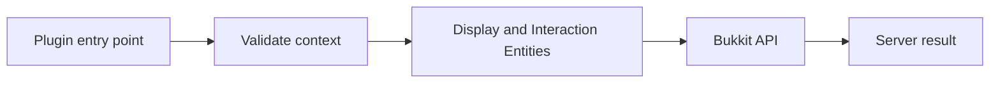

Display entities are visual-only entities designed for client rendering. Bukkit exposes `TextDisplay`, `ItemDisplay`, and `BlockDisplay` through the shared `Display` interface.

{/* visual-map:start */}
<Frame caption="A TextDisplay, ItemDisplay, and Interaction entity combined into one clickable hologram.">
  
</Frame>

## Visual map


{/* visual-map:end */}

## Spawn a text display

```java
TextDisplay label = world.spawn(location, TextDisplay.class, display -> {
    display.setText("Daily reward\nReady to claim");
    display.setBillboard(Display.Billboard.CENTER);
    display.setShadowed(true);
    display.setSeeThrough(false);
    display.setLineWidth(180);
    display.setViewRange(32.0f);
});
```

Text displays support line width, background color, opacity, shadow, see-through rendering, default background, and alignment. The shared display API controls billboard mode, brightness, glow override, view range, shadow, display dimensions, teleport duration, transformation, and interpolation.

## Items and blocks

```java
ItemDisplay model = world.spawn(location, ItemDisplay.class, display -> {
    display.setItemStack(icon);
    display.setItemDisplayTransform(ItemDisplay.ItemDisplayTransform.GUI);
    display.setInterpolationDuration(5);
});

BlockDisplay block = world.spawn(location, BlockDisplay.class, display ->
    display.setBlock(Material.AMETHYST_BLOCK.createBlockData())
);
```

An `ItemDisplay` renders an `ItemStack`, so resource-pack item models and item-model components can drive its appearance. A `BlockDisplay` renders `BlockData` without placing a physical block.

## Transformations and animation

`Display.setTransformation` uses translation, left rotation, scale, and right rotation. Interpolation lets the client animate between updates. Set interpolation duration before changing the transform; schedule coarse server updates instead of teleporting every tick when the client can interpolate smoothly.

Keep transformations finite and bounded. Extremely large scales or view ranges increase visual and tracking cost.

## Make visuals clickable

Display entities are not button widgets. Pair them with an `Interaction` entity at the same location and handle the appropriate entity interaction events. Store a persistent namespaced action ID on the interaction entity, not only on the display label.

Validate distance, world, line of sight if relevant, permission, cooldown, and current scene state. Remove both the display and interaction entity when the scene is destroyed.

## Persistence and cleanup

Decide whether displays should survive restarts. Mark temporary entities non-persistent, track their UUIDs, and remove them on plugin disable or scene teardown. For persistent scenes, store your scene definition and reconcile it on startup instead of assuming every old entity is valid.

Official references: [Display](https://hub.spigotmc.org/javadocs/bukkit/org/bukkit/entity/Display.html), [TextDisplay](https://hub.spigotmc.org/javadocs/bukkit/org/bukkit/entity/TextDisplay.html), [ItemDisplay](https://hub.spigotmc.org/javadocs/bukkit/org/bukkit/entity/ItemDisplay.html), [BlockDisplay](https://hub.spigotmc.org/javadocs/bukkit/org/bukkit/entity/BlockDisplay.html), and [Interaction](https://hub.spigotmc.org/javadocs/bukkit/org/bukkit/entity/Interaction.html).
