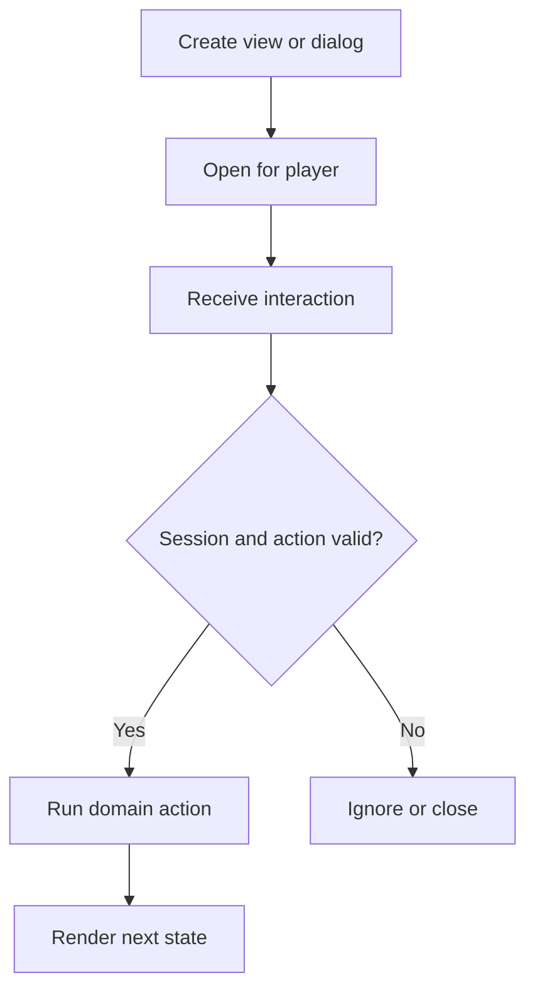

`MenuType` represents the vanilla menu types a player can view. Current Spigot provides typed constants and builders, including anvil, furnace, merchant, lectern, loom, stonecutter, crafter, crafting, generic chest grids, and more.

{/* visual-map:start */}
<Frame caption="A typed chest view used as a server navigator.">
  
</Frame>

## Visual map


{/* visual-map:end */}

<Warning>
`MenuType` and `InventoryViewBuilder` are currently experimental. Their signatures may change between server releases.
</Warning>

## Create a generic view

```java
InventoryView view = MenuType.GENERIC_9X3
    .builder()
    .title("Choose a destination")
    .build(player);

view.getTopInventory().setItem(11, destinationItem);
view.getTopInventory().setItem(15, cancelItem);
player.openInventory(view);
```

The player passed to `build` must be the same player that opens the view. A builder may be copied with `copy()` before changing its title or type-specific options.

For a one-line creation path, typed menu types also expose `create(player, title)`.

## Type-specific views

The generic parameters preserve the view interface at compile time. Examples include `AnvilView`, `BeaconView`, `CrafterView`, `EnchantmentView`, `FurnaceView`, `LecternView`, `LoomView`, `MerchantView`, and `StonecutterView`.

Location-based builders may accept a location, while merchant builders accept a `Merchant`. Check the builder subtype for the selected constant instead of casting blindly.

The old `openWorkbench`, `openEnchanting`, and merchant-opening helpers are deprecated in modern API versions. New code should create the appropriate typed view and pass it to `HumanEntity.openInventory(InventoryView)`.

## Click safety

Use `event.getRawSlot()` to distinguish the top menu from the player's inventory. `getSlot()` is relative to whichever inventory was clicked and can be ambiguous across the combined view.

Handle at least:

- number-key swaps and hotbar moves
- shift-click transfers
- double-click collection
- offhand swap
- drag events that cross top slots
- close/reopen and player disconnect
- item pickup and placement when the menu intentionally accepts input

Never identify a button only by display name or material. Use a custom holder/session, a persistent data key on the icon, or a server-side slot-to-action map.

## Updating an open view

Mutate the top inventory on the main server thread. For state-heavy menus, render the complete desired state into an array, then apply it. Avoid calling `Player.updateInventory()`; the official API marks it internal and says plugins should not normally need it.

Official references: [MenuType](https://hub.spigotmc.org/javadocs/bukkit/org/bukkit/inventory/MenuType.html), [MenuType.Typed](https://hub.spigotmc.org/javadocs/bukkit/org/bukkit/inventory/MenuType.Typed.html), and [InventoryViewBuilder](https://hub.spigotmc.org/javadocs/bukkit/org/bukkit/inventory/view/builder/InventoryViewBuilder.html).
