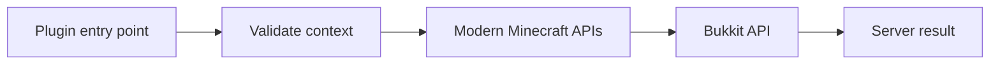

The current Spigot API exposes far more of modern Minecraft than the classic event-command-inventory tutorials show. This section focuses on APIs present in the current **Spigot-API 26.2-R0.1-SNAPSHOT** documentation.

{/* visual-map:start */}
## Visual map

{/* visual-map:end */}

<Warning>
Some modern surfaces are marked `@Experimental`. Compile against the exact API you target, feature-detect when practical, and test on the exact server build you ship.
</Warning>

## Pick the right surface

| Goal | Best supported surface | Notes |
| --- | --- | --- |
| Clickable grid UI | Inventory plus inventory events | Stable, familiar, works on unmodified clients |
| Vanilla workstation UI | `MenuType.Typed` and view builders | Typed anvil, furnace, merchant, lectern, loom, and other views |
| Form-like prompt | Player dialogs or a data-pack dialog | New and experimental; supports custom click callbacks |
| Floating text or models | `TextDisplay`, `ItemDisplay`, `BlockDisplay` | Visual-only entities with transforms and interpolation |
| Custom item behavior | Item meta components | Tools, weapons, food, consumables, cooldowns, equipment, models |
| Custom art and UI chrome | Resource pack | Changes client assets; acceptance and status must be handled |
| Data-driven content | Data packs, registries, tags, feature flags | Do not assume every registry entry exists in every world |
| Server links screen | `ServerLinks` and `Player.sendLinks` | Can be customized globally or per player |
| Arbitrary custom window | Client mod | Bukkit cannot invent a new native client screen |

## A modern UI stack

A polished server-side experience often combines several layers:

1. Use a dialog for confirmation or short structured input.
2. Open a typed inventory view for item selection or crafting behavior.
3. Use titles, action bars, boss bars, sounds, and particles as feedback.
4. Place display entities and interaction entities in the world.
5. Apply a resource pack for custom item models, fonts, textures, and sounds.
6. Store authoritative state server-side with persistent data or your database.

The server remains authoritative. Never trust a custom click identifier, inventory item, or client-provided value without validating the player's state, permission, distance, cooldown, and expected workflow step.

## Compatibility strategy

Keep modern code behind a small adapter boundary. A class such as `ModernUiGateway` can own calls to dialogs, typed builders, and new item components. The rest of your plugin calls your interface, making it possible to provide a fallback for older servers.

Use [the official current Javadocs](https://hub.spigotmc.org/javadocs/bukkit/) as the final source for signatures and experimental status.
