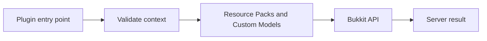

A resource pack is the supported way for an unmodified client to receive custom textures, models, fonts, sounds, and some UI assets. Bukkit requests the pack; the client downloads and renders it.

{/* visual-map:start */}
<Frame caption="Resource-pack models turn logical plugin items into distinct client visuals.">
  
</Frame>

## Visual map


{/* visual-map:end */}

## Send a versioned pack

```java
UUID packId = UUID.fromString("8cb3fb26-7d4d-4f45-a940-c1d93b96fc61");
byte[] sha1 = HexFormat.of().parseHex(configuredSha1);

player.setResourcePack(
    packId,
    configuredHttpsUrl,
    sha1,
    "This pack provides the server's custom items and interface.",
    true
);
```

Use HTTPS, a stable pack UUID, and the SHA-1 of the exact zip bytes. Change the pack ID or hash when the content changes according to your rollout strategy. Listen for `PlayerResourcePackStatusEvent` and do not assume the pack loaded immediately.

## Model selection

Modern `ItemMeta` supports an item-model namespaced key and a `CustomModelDataComponent`. The component can supply floats, flags, strings, and colors to the resource pack's model definitions.

Keep two identities separate:

- the server identity in persistent data, such as `myplugin:grappling_hook`
- the client rendering selector, such as an item-model key or custom-model component values

If the pack is missing, the base material should remain understandable and safe to use.

## Custom UI styling

Packs can replace container textures, add bitmap-font glyphs, and theme items used as menu buttons. They cannot create new networked widgets or give Bukkit arbitrary mouse coordinates. Avoid hiding essential meaning entirely in custom glyphs: accessibility settings, fonts, locale, pack failure, and other packs can change the result.

## Pack lifecycle

Track each player's latest status and gate pack-dependent experiences only after a successful load. Decide what happens on decline or failure: allow a functional fallback, deny entry to a themed area with a clear explanation, or retry only when the player explicitly requests it.

Never send a new request every join tick or repeatedly punish a client that cannot download the file. Log status transitions with the pack ID, but avoid storing unnecessary client information.

Official references: [Player.setResourcePack](https://hub.spigotmc.org/javadocs/bukkit/org/bukkit/entity/Player.html), [PlayerResourcePackStatusEvent](https://hub.spigotmc.org/javadocs/bukkit/org/bukkit/event/player/PlayerResourcePackStatusEvent.html), [ResourcePack](https://hub.spigotmc.org/javadocs/bukkit/org/bukkit/packs/ResourcePack.html), and [CustomModelDataComponent](https://hub.spigotmc.org/javadocs/bukkit/org/bukkit/inventory/meta/components/CustomModelDataComponent.html).
