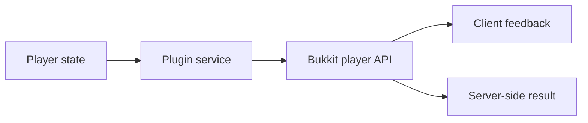

Current Spigot exposes several client-facing features that do not change authoritative server state.

{/* visual-map:start */}
## Visual map


{/* visual-map:end */}

## Server links

The server has a `ServerLinks` collection, and `Player.sendLinks(ServerLinks)` sends a collection to one player. Known link types receive client-localized labels and may have special client behavior.

```java
ServerLinks links = Bukkit.getServerLinks().copy();
// Add or replace entries using the methods exposed by the current ServerLinks API.
player.sendLinks(links);
```

Use `PlayerLinksSendEvent` when links need to be adjusted just before delivery. Work on the event's collection or a copy as documented; do not mutate global links accidentally for a per-player preference.

## Client-only illusions

`Player` can send block changes, block damage, equipment changes, health/experience views, sign text, map data, weather, time, world borders, potion-effect views, and hidden entities. These methods change what one client sees and normally do not mutate the real world or entity.

Always document whether a method is an illusion. Re-send state when the client changes world or reconnects, and expect normal server updates to overwrite temporary client views.

## Chat completions

`addCustomChatCompletions`, `removeCustomChatCompletions`, and `setCustomChatCompletions` manage extra suggestions shown while typing. They are suggestions, not command authorization. Command execution must still validate permission and arguments.

## Client cookies

Player cookie APIs can store and retrieve small namespaced values on supporting clients. Retrieval is asynchronous. Treat returned bytes as untrusted, bound their size, version your encoding, and never store secrets or authoritative balances in the client.

## Feedback hierarchy

Choose the least intrusive channel that fits:

| Channel | Good for |
| --- | --- |
| Action bar | short, rapidly changing status |
| Boss bar | timed progress or persistent objective |
| Title | rare, high-priority state change |
| Sound/particle | immediate spatial feedback |
| Sidebar | a handful of persistent metrics |
| Tab header/footer | server context and global information |
| Dialog | explicit decision or form-like action |

Official references: [ServerLinks](https://hub.spigotmc.org/javadocs/bukkit/org/bukkit/ServerLinks.html), [Player](https://hub.spigotmc.org/javadocs/bukkit/org/bukkit/entity/Player.html), and [PlayerLinksSendEvent](https://hub.spigotmc.org/javadocs/bukkit/org/bukkit/event/player/PlayerLinksSendEvent.html).
