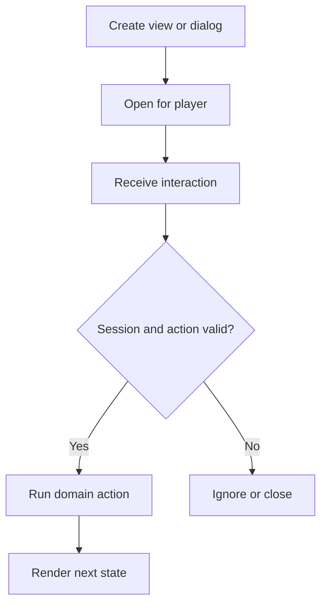

# Build a reusable GUI menu

Safe buttons, navigation, pagination, click protection, and cleanup.

{/* visual-map:start */}
<Frame caption="The finished menu layout used by this tutorial.">
  
</Frame>

## Visual map


{/* visual-map:end */}

This tutorial builds a complete feature with explicit ownership, validation, cleanup, and test cases.

## Architecture

- **Domain service:** owns rules and state.
- **Bukkit adapter:** receives commands, events, or inventory clicks.
- **Storage adapter:** persists only when the feature requires it.
- **Lifecycle owner:** creates and shuts down all resources.

```java
public interface FeatureService {
    Result execute(UUID playerId, Request request);
    void shutdown();
}

public record Result(boolean success, String message) {}
```

## Connect the feature to Bukkit

```java
public final class FeatureListener implements Listener {
    private final FeatureService service;

    public FeatureListener(FeatureService service) {
        this.service = service;
    }

    @EventHandler(ignoreCancelled = true)
    public void onInteract(PlayerInteractEvent event) {
        Result result = service.execute(
            event.getPlayer().getUniqueId(),
            new Request(event.getAction().name())
        );
        if (!result.success()) event.getPlayer().sendMessage(result.message());
    }
}
```

## Own the lifecycle

```java
@Override
public void onEnable() {
    service = createFeatureService();
    getServer().getPluginManager()
        .registerEvents(new FeatureListener(service), this);
}

@Override
public void onDisable() {
    if (service != null) service.shutdown();
}
```

## Handle failure paths

Test permission denial, invalid input, duplicate actions, disconnects, world unloads, storage failure, restart recovery, and many simultaneous players.

<Check>
The feature is complete when it has one clear owner, deterministic cleanup, bounded state, main-thread-safe Bukkit access, and repeatable tests.
</Check>
