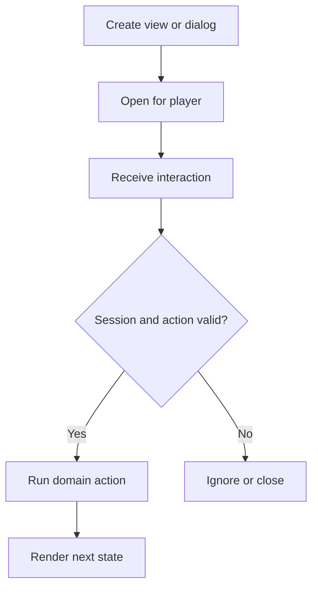

This tutorial builds the server-side half of a modern dialog workflow. The dialog definition itself is supplied by your matching data pack under the key `myplugin:confirm_reset`.

{/* visual-map:start */}
<Frame caption="The confirmation experience built in this tutorial.">
  
</Frame>

## Visual map


{/* visual-map:end */}

## 1. Store pending intent

```java
public record PendingReset(UUID nonce, long expiresAtMillis) {
    boolean expired() {
        return System.currentTimeMillis() > expiresAtMillis;
    }
}

private final Map<UUID, PendingReset> pending = new HashMap<>();
private final NamespacedKey dialogKey =
    new NamespacedKey("myplugin", "confirm_reset");
private final NamespacedKey confirmAction =
    new NamespacedKey("myplugin", "confirm_reset_action");
```

## 2. Open the dialog

```java
public void askToReset(Player player) {
    if (!player.hasPermission("myplugin.reset")) {
        return;
    }

    pending.put(
        player.getUniqueId(),
        new PendingReset(UUID.randomUUID(), System.currentTimeMillis() + 30_000)
    );

    try {
        player.showDialog(dialogKey);
    } catch (IllegalArgumentException unsupportedOrMissing) {
        openInventoryFallback(player);
    }
}
```

Do not perform the reset when opening the screen. Opening only records an expiring intent.

## 3. Consume the action once

```java
@EventHandler
public void onCustomClick(PlayerCustomClickEvent event) {
    if (!event.getId().equals(confirmAction)) {
        return;
    }

    Player player = event.getPlayer();
    PendingReset request = pending.remove(player.getUniqueId());

    if (request == null || request.expired()) {
        player.sendMessage("That request expired.");
        player.clearDialog();
        return;
    }

    if (!player.hasPermission("myplugin.reset")) {
        return;
    }

    resetDataAtomically(player.getUniqueId());
    player.clearDialog();
    player.sendMessage("Your data was reset.");
}
```

Validate any JSON payload separately and accept only the fields, types, and lengths you expect. The nonce can be included in the action data when the dialog system and your definition support it, but the server-side pending record remains authoritative.

## 4. Cleanup

Remove pending entries on quit, plugin disable, cancel actions, and timeout. Make the reset operation idempotent or transactional so a duplicate network action cannot apply it twice.

The inventory fallback should call the same `resetDataAtomically` method after identical permission and expiry checks. Only the presentation changes.
